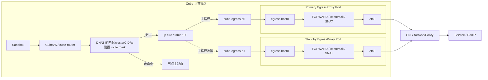

# EgressProxy 本地 veth 方案

[English](./EGRESS_VETH_EN.md) | 中文

## 1. 目标

本方案只转发 sandbox 访问 Kubernetes Pod CIDR 和 Service CIDR 的请求，并使
这些请求受 Kubernetes NetworkPolicy 控制。

要求：

- 非集群 CIDR 不经过 EgressProxy；
- 正常链路不使用加密隧道、UDP 封装或用户态代理；
- 每个计算节点都有本地主、备 EgressProxy；
- EgressProxy 全部不可用时，集群 CIDR 流量 fail closed；
- Cube Big Pod 更新不重建 veth、策略路由和存量 sandbox；
- 目标 Pod 观察到的来源地址是 EgressProxy PodIP；
- sandbox 经 EgressProxy 发出的集群访问请求可被用户自定义 NetworkPolicy 管理；
- Chart 不创建、修改、删除或推荐任何具体 NetworkPolicy；
- 用户配置保持最小，不暴露内部路由和 veth 实现参数。

## 2. 架构

每个 Cube 计算节点运行两个普通 Pod 网络的 EgressProxy：

- `egress-proxy-primary` DaemonSet；
- `egress-proxy-standby` DaemonSet。

每个 Proxy Pod 通过独立 veth pair 与所在宿主机连接。EgressProxy 使用普通
Pod `eth0` 访问目标，因此出口继续由 CNI 和 Kubernetes NetworkPolicy 管理。



正常数据路径：

```text
Sandbox
→ CubeVS
→ cube-router
→ DNAT 前匹配 clusterCIDRs
→ route mark
→ table 100
→ 本地 veth
→ EgressProxy Pod
→ conntrack / SNAT
→ Pod eth0
→ CNI / NetworkPolicy
→ Service 或 PodIP
```

非集群 CIDR 数据路径：

```text
Sandbox
→ CubeVS
→ cube-router
→ 不设置 route mark
→ 节点主路由
```

## 3. Chart 配置

用户只需要配置是否启用和集群 CIDR：

```yaml
egressProxy:
  enabled: true
  clusterCIDRs:
    - 10.244.0.0/16
    - 10.96.0.0/12
```

约束：

- `clusterCIDRs` 必须显式配置；
- 必须覆盖集群全部 Pod CIDR 和 Service CIDR；
- 只支持 IPv4；
- 最多 32 个 CIDR；
- 完全相同的重复项、非法项或空配置必须阻止 Chart 安装；
- 指向同一网段但主机位写法不同的 CIDR 由 Configurer 规范化并去重；
- Chart 不创建、修改、删除或推荐 NetworkPolicy；
- 用户根据业务需要独立创建任意 Kubernetes NetworkPolicy。

以下参数属于内部实现，不放入 values：

| 参数 | 固定值 |
| --- | --- |
| route mark | `0x1000/0x1000` |
| policy rule priority | `10900` |
| route table | `100` |
| 主 veth 网段 | `169.254.240.0/30` |
| 备 veth 网段 | `169.254.240.4/30` |
| 主机接口 | `cube-egress-p0`、`cube-egress-p1` |
| Pod 接口 | `egress-host0` |
| 每节点 Proxy 数量 | `2` |
| 调和周期 | `10s` |

Configurer 写入节点路由状态前检测固定 mark、iptables 链、rule priority 和
route table；Proxy init 在创建 veth 前检测接口名及 link-local 网段。任一组件
发现冲突时都拒绝 Ready，不允许覆盖已有配置；生产安装必须使用 `helm --wait`
并检查全部 Configurer 和 Proxy Ready。

## 4. veth 配置

### 4.1 Primary

```text
宿主机：
  cube-egress-p0 = 169.254.240.1/30

Proxy Pod：
  egress-host0 = 169.254.240.2/30
```

### 4.2 Standby

```text
宿主机：
  cube-egress-p1 = 169.254.240.5/30

Proxy Pod：
  egress-host0 = 169.254.240.6/30
```

上述地址只存在于独立的节点和 Pod network namespace。不同节点可以复用同一
组 link-local 地址。

veth MTU 自动读取 Proxy Pod `eth0` MTU，不提供 values 参数。宿主机和 Pod
两端使用相同 MTU，避免额外分片。

### 4.3 生命周期

Proxy 使用 `hostPID: true`，由短生命周期的 privileged initContainer：

1. 清理本节点同名的无效旧接口；
2. 在 Pod network namespace 创建 veth pair；
3. 将 host 端移动到宿主机 network namespace；
4. 配置两端地址、MTU 和 link up；
5. 在 Pod 内增加 Router NATIP 的回程路由。

Proxy 主容器不使用 privileged，只保留 `NET_ADMIN`。Pod network namespace
销毁时，Pod 侧 veth 和对应 host peer 一并失效；Configurer 在下一次调和中
清理残留路由。

两个 DaemonSet 使用：

```yaml
updateStrategy:
  type: OnDelete
```

`OnDelete` 防止主、备控制器同时滚动同一节点。普通 Helm upgrade 只更新 Pod
template，不会替换现有 Proxy Pod。主备替换顺序和回滚操作统一见
[UPGRADE.md](./UPGRADE.md)。

## 5. CIDR 分流

只在 `mangle/PREROUTING` 第一条规则处理来自 Cube Router 的 sandbox 报文：

```bash
iptables -t mangle -A CUBE-EGRESS-MARK \
  -d <cluster-cidr> \
  -j MARK \
  --set-xmark 0x1000/0x1000

iptables -t mangle -I PREROUTING 1 \
  -s <router-nat-ip>/32 \
  -i cube-router \
  -j CUBE-EGRESS-MARK
```

必须在 Service DNAT 前匹配原始 ClusterIP。否则 ClusterIP 可能先转换为 NodeIP，
导致后续按目标 CIDR 的策略路由失效。

策略规则：

```bash
ip rule add priority 10900 \
  iif cube-router \
  from <router-nat-ip>/32 \
  fwmark 0x1000/0x1000 \
  lookup 100
```

未命中 `clusterCIDRs` 的报文没有 mark，不进入 table 100。

## 6. Proxy 转发

Primary 对应的正常路由：

```bash
ip route replace table 100 \
  default via 169.254.240.2 \
  dev cube-egress-p0 \
  metric 100

ip route replace table 100 \
  unreachable default \
  metric 32767
```

Proxy Pod 内配置：

```bash
ip route replace <router-nat-ip>/32 \
  via 169.254.240.1 \
  dev egress-host0

iptables -t filter -N CUBE-EGRESS-PROXY
iptables -t filter -A CUBE-EGRESS-PROXY \
  -i egress-host0 -o eth0 \
  -j ACCEPT
iptables -t filter -A CUBE-EGRESS-PROXY \
  -i eth0 -o egress-host0 \
  -m conntrack \
  --ctstate ESTABLISHED,RELATED \
  -j ACCEPT
iptables -t filter -A CUBE-EGRESS-PROXY -j DROP

iptables -t nat -A POSTROUTING \
  -i egress-host0 \
  -o eth0 \
  -j SNAT \
  --to-source <proxy-pod-ip>
```

目标 Pod 只能看到 EgressProxy PodIP，不能看到 sandbox IP、Router NATIP 或
link-local veth 地址。

## 7. 健康检查与故障切换

Proxy 主容器完成转发规则检查后，在对应 veth 地址提供 TCP 健康响应。
Configurer 通过该响应选择活动 Proxy：

```text
cube-egress-p0 → 169.254.240.2:19091
cube-egress-p1 → 169.254.240.6:19091
```

选择规则：

1. 当前活动 Proxy 健康时保持粘滞；
2. 当前 Proxy 探测失败时选择另一个健康 Proxy；
3. 切换只替换 table 100 的活动默认路由；
4. 两个 Proxy 均失败时删除活动默认路由；
5. table 100 始终保留 `unreachable default`；
6. Proxy 恢复后不自动回切。

切换到 standby：

```bash
ip route replace table 100 \
  default via 169.254.240.6 \
  dev cube-egress-p1 \
  metric 100
```

两个 Proxy 均失败：

```text
table 100:
  unreachable default metric 32767
```

此时只有已标记的集群 CIDR 流量失败，非集群 CIDR、节点进程、普通 Pod 和
HostNetwork Pod 不受影响。

主备 Proxy 不共享 conntrack。活动 Proxy 故障或重建时，经过该 Proxy 的存量
连接可能中断；新连接在切换后恢复。

健康响应能够识别 Proxy 主进程退出、veth 异常以及 Proxy 转发/SNAT 规则缺失。
由于用户 NetworkPolicy 可以任意拒绝目标，Configurer 不使用具体 PodIP 或
Service 作为探测目标，因此目标服务或 CNI 出口故障仍由业务探针发现。

## 8. NetworkPolicy

本方案只保证经过 EgressProxy 的 sandbox 请求能够被 CNI 识别为 Proxy Pod
出口流量，从而受用户定义的 Kubernetes NetworkPolicy 管理。

NetworkPolicy 完全是用户侧资源：

- 用户自行决定是否创建策略以及策略的全部内容；
- Chart 不创建、修改、删除或推荐任何 NetworkPolicy；
- Chart 不提供默认拒绝、DNS 放行、业务放行等内置规则；
- Chart 安装、升级、回滚、关闭功能和卸载均不触碰用户策略。

没有用户 NetworkPolicy 时，行为遵循当前 CNI 和 Kubernetes 默认语义，Chart
不额外限制出口。

由于数据从 `egress-host0` 转发后通过 Pod `eth0` 离开，是否执行 egress
NetworkPolicy 取决于 CNI 对 Pod 内转发流量的实现。上线前必须在目标 CNI 上
真实验证，不能只检查 YAML。

验收只需由测试人员临时定义策略，证明 sandbox 请求的允许和拒绝结果符合该
策略，同时普通 Pod、HostNetwork Pod 和节点流量不被 EgressProxy 路径误伤。
测试策略不是产品资源或推荐模板，测试结束后由测试人员删除。

当前 Cube Router 会把同一节点的 sandbox 请求统一转换为 Router NATIP，
EgressProxy 无法区分该节点上的不同 sandbox。因此用户策略的最小隔离粒度是
EgressProxy Pod/节点，不支持按单个 sandbox 设置不同 NetworkPolicy。

## 9. 安全

- 只标记来自 `cube-router`、源地址为 Router NATIP、目标属于
  `clusterCIDRs` 的报文；
- 不处理节点 `OUTPUT`；
- table 100 保留 `unreachable default`；
- FORWARD 第一条规则先处理已标记流量，禁止回落其他 CNI 放行链；
- initContainer 完成 veth 创建后退出；
- Proxy 主容器禁止长期 privileged；
- 不挂载 Docker socket、containerd socket 或宿主 `/sys`；
- 固定 mark、路由表、优先级、接口和地址发生冲突时拒绝启动；
- Configurer 只管理 `CUBE-EGRESS-*` 链和固定的专用对象，不清空 CNI 或
  kube-proxy 管理的规则。

`hostPID: true` 和 privileged initContainer 扩大了初始化阶段权限。镜像必须
使用不可变 digest，并完成签名、漏洞扫描和准入校验。

Proxy 的 privileged initContainer 和 HostNetwork Configurer 不符合 Kubernetes
Pod Security `baseline`/`restricted`。目标 namespace 必须通过受控豁免允许这些
权限；如果集群策略禁止该豁免，则不能启用 EgressProxy。豁免范围只应覆盖
`cube-egress` 与 `cube-system` 中的对应 ServiceAccount/工作负载。

## 10. 性能

正常链路只增加：

- 一次本地 veth 转发；
- Proxy namespace 内 conntrack 和 SNAT；
- Proxy `eth0` 的一次 CNI 出口处理。

链路不包含：

- 加解密；
- UDP 封装；
- 隧道握手；
- 隧道 MTU 额外缩减；
- 到共享 Proxy 的额外跨节点跳数。

性能不能根据设计直接判定通过，必须与同一 sandbox 的直连基线比较。

验收门槛：

| 指标 | 门槛 |
| --- | --- |
| 新建 TCP 连接额外延迟 P50 | ≤ 1 ms |
| 新建 TCP 连接额外延迟 P99 | ≤ 5 ms |
| 已建立连接单向额外延迟 P99 | ≤ 2 ms |
| 单连接吞吐 | ≥ 直连的 90% |
| 节点聚合吞吐 | ≥ 直连的 85% |
| 代理错误率 | < 0.01% |

完整发布验收的新建连接延迟和吞吐应分别测试同节点目标、跨节点目标、
ClusterIP、PodIP、单连接和多连接。已建立连接延迟使用跨节点 PodIP 作为代表
路径；Service 选择和 DNAT 在建连阶段完成，不重复计入已建立路径门槛。当前
测试报告只记录已经完成的组合，未覆盖的必测组合不得据此宣告通过。

实测结果和门禁证据统一记录在 [EGRESS_TEST.md](./EGRESS_TEST.md)，不在方案文档
中重复维护。
