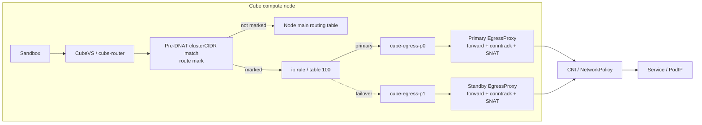

# Local-veth EgressProxy Design

English | [中文](./EGRESS_VETH.md)

## 1. Goal

Forward only sandbox requests to Kubernetes Pod and Service CIDRs through an
EgressProxy Pod so that the CNI can enforce user-defined NetworkPolicy.

The design must:

- bypass EgressProxy for non-cluster destinations;
- avoid encryption, UDP encapsulation, and user-space proxying on the normal
  path;
- provide node-local primary and standby proxies;
- fail closed for marked cluster traffic when both proxies fail;
- preserve node veth/routing state across Big Pod replacement;
- expose the EgressProxy Pod IP, rather than sandbox or router addresses, to
  the destination;
- keep NetworkPolicy entirely user-owned;
- expose only the minimum required values.

## 2. Architecture

Every compute node runs primary and standby EgressProxy DaemonSet Pods on the
Pod network. Each proxy is connected to its host by a dedicated veth pair.



Cluster path:

```text
Sandbox → CubeVS → cube-router → pre-DNAT CIDR match → route mark
→ table 100 → local veth → EgressProxy Pod → SNAT → Pod eth0
→ CNI / NetworkPolicy → Service or PodIP
```

Non-cluster traffic receives no mark and follows the node's normal route.

## 3. Chart configuration

Users configure only enablement and all Pod/Service CIDRs:

```yaml
egressProxy:
  enabled: true
  clusterCIDRs:
    - 10.244.0.0/16
    - 10.96.0.0/12
```

`clusterCIDRs` is required, IPv4-only, and limited to 32 entries. Empty,
duplicate, or invalid entries fail chart rendering. Equivalent CIDRs are
canonicalized and deduplicated by the Configurer. The chart never creates,
modifies, deletes, or recommends a NetworkPolicy.

Fixed implementation details are intentionally not values:

| Item | Value |
| --- | --- |
| Route mark | `0x1000/0x1000` |
| Policy-rule priority | `10900` |
| Route table | `100` |
| Primary veth subnet | `169.254.240.0/30` |
| Standby veth subnet | `169.254.240.4/30` |
| Host interfaces | `cube-egress-p0`, `cube-egress-p1` |
| Proxy interface | `egress-host0` |
| Proxies per node | `2` |
| Reconcile interval | `10s` |

All fixed rules, tables, marks, addresses, and interface names are ownership
checked. A conflict prevents readiness instead of overwriting foreign state.

## 4. Veth lifecycle

Primary uses host `169.254.240.1/30` and proxy `169.254.240.2/30`; standby uses
host `169.254.240.5/30` and proxy `169.254.240.6/30`. These link-local addresses
exist only in independent node and Pod network namespaces, so nodes can reuse
them. MTU follows the Proxy Pod's `eth0`.

A short-lived privileged initContainer with `hostPID: true`:

1. removes only invalid, component-owned stale interfaces;
2. creates the veth pair in the Proxy network namespace;
3. moves the host peer into the node network namespace;
4. configures addresses, MTU, and link state;
5. adds the return route for the Cube Router NAT IP.

The long-running Proxy container is not privileged and retains only
`NET_ADMIN`. Both Proxy DaemonSets use `OnDelete`, preventing simultaneous
primary/standby replacement on a node.

## 5. CIDR steering

The first `mangle/PREROUTING` jump processes only packets arriving from
`cube-router`, sourced from the Router NAT IP:

```bash
iptables -t mangle -A CUBE-EGRESS-MARK \
  -d <cluster-cidr> -j MARK --set-xmark 0x1000/0x1000

iptables -t mangle -I PREROUTING 1 \
  -s <router-nat-ip>/32 -i cube-router -j CUBE-EGRESS-MARK

ip rule add priority 10900 \
  iif cube-router from <router-nat-ip>/32 \
  fwmark 0x1000/0x1000 lookup 100
```

Matching must occur before Service DNAT, while the original ClusterIP remains
visible. Unmarked traffic never enters table 100.

## 6. Proxy forwarding

The active route points table 100 to one local peer and always coexists with a
fail-closed route:

```bash
ip route replace table 100 \
  default via 169.254.240.2 dev cube-egress-p0 metric 100
ip route replace table 100 unreachable default metric 32767
```

Inside the Proxy namespace, forwarding permits only `egress-host0 → eth0` and
established/related return traffic. Other traffic in the component chain is
dropped. SNAT rewrites the source to the Proxy Pod IP, which is the identity
observed by the destination and CNI.

## 7. Health and failover

Each Proxy serves a TCP health response on its veth address and port `19091`.
The Configurer keeps the current healthy peer, switches only after failure,
removes the active default when both peers fail, and never removes the
`unreachable default`. Recovery does not force switch-back.

Primary and standby do not share conntrack. Existing connections through a
failed or replaced Proxy may break; new connections recover after route switch.
Health validates the Proxy process, veth, and component forwarding/SNAT rules,
but intentionally does not probe a user Service that NetworkPolicy may deny.

## 8. NetworkPolicy boundary

The design guarantees only that sandbox cluster traffic leaves through a Proxy
Pod identity that the target CNI can govern. Users own whether a policy exists
and all allow/deny content. With no user policy, normal Kubernetes/CNI defaults
apply.

Because all sandboxes on a node are translated to the same Router NAT IP and
then to a Proxy Pod IP, the minimum policy granularity is Proxy Pod/node, not an
individual sandbox. The target CNI must be tested with real forwarded traffic;
rendered YAML alone is insufficient evidence.

## 9. Security and admission requirements

- Only clusterCIDR traffic from the expected interface and Router NAT IP is
  marked; node `OUTPUT` is never intercepted.
- Table 100 remains fail closed and marked traffic cannot fall through to
  unrelated CNI forwarding chains.
- Components manage only dedicated `CUBE-EGRESS-*` chains and fixed objects.
- The Proxy does not mount container-runtime sockets or host `/sys`.
- Images should use immutable digests and pass signature, vulnerability, and
  admission checks.

The privileged veth initContainer and HostNetwork Configurer are incompatible
with Pod Security `baseline` and `restricted`. A narrowly scoped exemption is
required for the corresponding workloads/ServiceAccounts in `cube-egress` and
`cube-system`. If the cluster cannot grant it, EgressProxy cannot be enabled.

## 10. Performance gate

The normal path adds one local veth forwarding step, Proxy conntrack/SNAT, and
one CNI egress pass. It adds no encryption, tunnel handshake, UDP encapsulation,
or cross-node proxy hop.

| Metric | Gate |
| --- | --- |
| New TCP connection additional latency P50 | ≤ 1 ms |
| New TCP connection additional latency P99 | ≤ 5 ms |
| Established-path one-way additional latency P99 | ≤ 2 ms |
| Single-connection throughput | ≥ 90% of direct |
| Node aggregate throughput | ≥ 85% of direct |
| Proxy error rate | < 0.01% |

Test same-node/cross-node PodIP and Service IP paths, with single and concurrent
connections. Evidence is maintained in [EGRESS_TEST_EN.md](./EGRESS_TEST_EN.md).
