# CubeSandbox Chart 升级指南

[English](./UPGRADE_EN.md) | 中文

本文说明当前 Helm Chart 的升级边界和操作流程。文档以 Chart 模板、values
和组件入口脚本的实际行为为准，不包含尚未实现的发布控制器或监控能力。

> **不兼容变更：** `cube-node` Big Pod 已从 Pod 网络切换为固定的
> `hostNetwork: true` 和 `dnsPolicy: ClusterFirstWithHostNet`。旧 Pod 在被替换前
> 仍保持原 Pod 网络语义；只有明确删除或滚动替换后，新网络契约才会生效。
> 发布前必须迁移依赖旧 PodIP/CNI 可见性的监控与安全配置，并先在单个计算节点
> 进行 canary 验证。

## 原地升级与 EgressProxy 总体架构

`cube-node` Big Pod 升级时 Pod 会被替换，但 sandbox 运行时、状态和网络留在
宿主机，由新 Pod 重新接管。EgressProxy 使用独立 DaemonSet，与 Big Pod
生命周期解耦，使存量 sandbox 在升级期间仍可访问集群服务，并受用户定义的
Kubernetes NetworkPolicy 控制。

```mermaid
flowchart LR
    subgraph K8S["Kubernetes 管理层：可替换"]
        OLD["旧 cube-node Big Pod<br/>旧 cubelet"]
        UPDATE["DaemonSet 更新<br/>替换 Pod"]
        NEW["新 cube-node Big Pod<br/>新 cubelet<br/>hostPID + hostNetwork"]
        OLD --> UPDATE --> NEW
    end

    subgraph HOST["计算节点宿主持久层：Big Pod 更新不删除"]
        RUNTIME["CubeShim + VMM<br/>宿主 cgroup 中持续运行"]
        STATE["hostPath + socket<br/>/data/cubelet<br/>/data/cube-shim"]
        SANDBOX["存量 Sandbox<br/>ID、guest、进程不变"]
        ROUTER["network-agent + Cube Router<br/>sandbox netns / TAP 保持"]

        STATE --- RUNTIME
        RUNTIME --> SANDBOX
        ROUTER --- SANDBOX
    end

    subgraph EGRESS["独立 EgressProxy 数据面：不随 Big Pod 更新"]
        CONFIG["Configurer DaemonSet<br/>维护 mark、table 100 和主备健康"]
        RULES["节点策略路由<br/>mangle/PREROUTING<br/>mark → table 100"]
        VETH["节点本地 veth<br/>Primary / Standby"]
        PROXY["EgressProxy Pod<br/>转发 + SNAT"]
        POLICY["用户 NetworkPolicy"]
        SERVICE["Kubernetes Service / Pod"]

        CONFIG -.->|"配置宿主规则"| RULES
        CONFIG -.->|"选择健康路径"| VETH
        RULES --> VETH --> PROXY
        PROXY -->|"以 Pod 身份进入 CNI"| POLICY --> SERVICE
    end

    OLD -.->|"旧控制连接"| STATE
    NEW ==>|"读取原状态和 socket<br/>重新接管存量运行时"| STATE
    NEW ==>|"复用宿主网络数据面"| ROUTER
    SANDBOX -->|"访问 clusterCIDRs"| ROUTER
    ROUTER -->|"沙箱流量进入节点"| RULES

    classDef replaceable fill:#e8f1ff,stroke:#3973ac,color:#102a43;
    classDef persistent fill:#e9f8ee,stroke:#2f855a,color:#173b2b;
    classDef egress fill:#fff4df,stroke:#b7791f,color:#4a2d0b;
    class OLD,UPDATE,NEW replaceable;
    class RUNTIME,STATE,SANDBOX,ROUTER persistent;
    class CONFIG,RULES,VETH,PROXY,POLICY,SERVICE egress;
```



图中的关键边界：

- Big Pod 的 UID、容器和 cubelet PID 会变化；sandbox ID、创建时间、
  CubeShim/VMM PID、guest boot ID 和网络命名空间保持不变。
- CubeShim、VMM 脱离 `kubepods` cgroup，状态和 socket 位于 hostPath，因此
  旧 Pod 删除不会销毁存量 sandbox。
- 新 cubelet 读取相同 hostPath，并通过既有 socket 重新接管 CubeShim/VMM；
  这是“接管”，不是重新创建 sandbox。
- EgressProxy、Configurer 是独立 DaemonSet。Big Pod 更新不重建它们，也不删除
  节点的本地 veth、策略路由或用户 NetworkPolicy。
- 只有 sandbox 访问 `clusterCIDRs` 的请求被 Cube Router 标记并送入 table 100，
  再经本地 veth 进入 EgressProxy；其他节点、Pod 和非集群流量不走该链路。
- EgressProxy 以 Pod 身份从 CNI 发出请求，因此用户可以用 NetworkPolicy 控制
  sandbox 能访问哪些 Kubernetes Service 或 Pod。

## 1. 当前升级模型

计算节点由四个原生 `apps/v1` DaemonSet 组成：

| 组件 | 职责 | 更新影响 |
| --- | --- | --- |
| `cube-node-installer` | 安装 shim、kernel 和 guest 产物 | 不承载运行时数据面 |
| `cube-node-pvm` | 在明确授权的节点安装 PVM 宿主机内核 | 可能修改内核、GRUB 并触发重启 |
| `cube-node-bootstrap` | 检查并准备 KVM、XFS 和节点目录 | 不承载运行时数据面 |
| `cube-node` | 运行 cubelet、network-agent 和可选 CubeEgress | Pod 模板变化会重建 Big Pod |

`cube-node` 固定使用：

```yaml
hostPID: true
hostNetwork: true
dnsPolicy: ClusterFirstWithHostNet
```

默认更新策略是 `RollingUpdate`，`maxUnavailable: 1`。如需逐节点人工控制，
可配置：

```yaml
cubeNode:
  updateStrategy:
    type: OnDelete
```

`OnDelete` 模式下，Helm 只更新 DaemonSet Pod template，不会自动删除旧 Pod。

## 2. 存量 sandbox 保留边界

Big Pod 重建时，Chart 通过以下机制保留存量 sandbox：

- shim、VMM 使用宿主机 PID namespace，并脱离 Big Pod 容器 cgroup 运行；
- `/data/cubelet`、`/data/cube-shim`、`/run/containerd` 对应目录和
  `/run/vc` 对应目录使用 hostPath；
- 实际 socket hostPath 默认为 `/data/cubelet/run/containerd` 和
  `/data/cubelet/run/vc`，避免与节点容器运行时目录冲突；
- cubelet 启动后通过已有 bootstrap state 和 socket 连接存量 shim；
- network-agent 镜像指纹未变化时，新 Big Pod 复用宿主机上的原进程。

`hostPID` 和 `hostNetwork` 本身不能保证进程存活，存量 sandbox 保留依赖上述
入口脚本、进程 cgroup 和 hostPath 机制同时生效。

以下变更不能按普通 cubelet 滚动升级处理：

- network-agent 镜像变化；
- Cube Router、sandbox CIDR、网卡或底层网络配置变化；
- shim、VMM、guest 或其状态格式不兼容；
- hostPath、socket 目录或节点内核变化。

这些变更应作为维护操作单独验证。文档不承诺它们升级期间连接无损。

## 3. EgressProxy 边界

数据路径、固定网络参数和故障切换逻辑见
[EGRESS_VETH.md](./EGRESS_VETH.md)，本节只保留升级相关约束。

`egressProxy.enabled=true` 时，Chart 部署：

- `cube-node` 中的持久化 Cube Router 数据面；
- HostNetwork 的 `egress-configurer` DaemonSet；
- Pod 网络中的主、备 `egress-proxy` DaemonSet；
- 固定的 `cube-egress` namespace。

Proxy Pod 通过本地 veth 与宿主机连接。Configurer 在宿主机维护 veth 健康
探测、iptables 和策略路由。Big Pod 重建不会删除这些对象；network-agent
被复用时，Cube Router 接口也保持不变。

升级相关限制：

- 用户 NetworkPolicy 选择 EgressProxy Pod，当前不能按单个 sandbox 区分；
- Proxy Pod 重建会丢失其网络命名空间中的 conntrack，经过该副本的
  长连接可能中断；
- Configurer 和两个 Proxy DaemonSet 固定使用 `OnDelete`，镜像更新必须按
  发布顺序逐节点替换；
- Chart 没有实现连接 drain、自动发布编排或 Prometheus 指标采集。

新安装由 Chart 创建 `cube-egress` namespace。升级时如果该 namespace 已经
存在且不属于当前 Helm release，Chart 复用它但不接管所有权，避免覆盖其中
的用户策略或其他资源。由当前 release 创建的 namespace 在后续升级中继续由
Helm 管理，但使用 `helm.sh/resource-policy: keep` 保留；关闭功能或卸载
release 不删除 namespace，也不会间接删除其中的用户 NetworkPolicy。

关闭 `egressProxy` 或删除 Configurer Pod 时，Pod 的 `preStop` 会先暂停协调循环，
再清理本组件拥有的宿主机规则。卸载 release 时还会在 `post-delete` 阶段按节点
运行一次兜底清理。
清理逻辑只删除所有权校验通过的
`CUBE-EGRESS-*` 链、固定 FORWARD 规则、priority 10900 policy rule 和 table
100 专用路由。发现同名外部对象时清理失败并阻止继续操作，不覆盖或删除外部
配置。关闭时必须使用 `helm upgrade --wait`，并在 Configurer Pod 删除后检查
各节点规则；卸载时必须使用 `helm uninstall --wait`，并确认 `post-delete`
清理 hook 在全部计算节点完成。节点不可达、强制删除 Pod 或绕过 kubelet 时
无法执行 `preStop`，需要节点恢复后运行同一清理镜像，不宣称自动清理此类异常
残留。

## 4. 发布前检查

### 4.1 渲染与静态检查

```bash
helm lint deploy/kubernetes/chart

deploy/kubernetes/chart/scripts/test-big-pod-inplace-guard.sh
deploy/kubernetes/chart/scripts/test-egress-proxy-guard.sh
```

生产 values 应额外执行一次 `helm template`，确认：

- 目标镜像和 tag/digest 正确；
- 计算节点 selector 只匹配预期节点；
- PVM selector 包含 `cube.tencent.com/allow-pvm-bootstrap=true`；
- `cube-node` 更新策略符合本次发布方式；
- EgressProxy 只渲染主备 DaemonSet、Configurer 和 namespace；
- 渲染结果不包含 EgressProxy NetworkPolicy、隧道 Secret、Service 或
  StatefulSet。

### 4.2 节点检查

确认：

- `/dev/kvm`、XFS、内核和节点准备状态满足要求；
- sandbox CIDR 不与 Node、Pod、Service、VPC 和 DNS 网段重叠；
- `/data/cubelet` 等 hostPath 容量充足；
- 当前 sandbox、shim、VMM 和 network-agent 状态正常；
- EgressProxy 启用时，Configurer 和全部 Proxy Pod Ready；当前活动 Peer 的
  主进程健康响应成功；mangle 链在 Service DNAT 前只标记
  `clusterCIDRs`；策略规则同时匹配 cube-router 入接口、Router NATIP 和
  `routeMark`；table 100 同时保留活动默认路由和 `unreachable default`。

Chart 不提供节点 drain、禁止新建 sandbox 或升级状态机。需要这些能力时，
必须由现有运维系统在 Helm 升级之外完成。

## 5. 推荐发布顺序

“原地升级”采用文档开头架构：Big Pod 会重建，sandbox 留在宿主机并由新
cubelet 接管。readiness 只证明新 Big Pod 基础服务正常，不能替代存量
sandbox 验收。

推荐先升级不承载运行时数据面的 installer、PVM 和 bootstrap 组件；如启用
EgressProxy，先确认主备 Proxy DaemonSet 和 Configurer 健康，再按上述隔离
边界更新 `cube-node` DaemonSet。全节点完成后，使用用户自定义 NetworkPolicy
验证允许和拒绝结果，并回归入站访问与 sandbox 生命周期。

如果 `cubeNode.updateStrategy.type=OnDelete`，逐节点执行：

```bash
kubectl -n <namespace> delete pod <old-cube-node-pod>
kubectl -n <namespace> wait \
  --for=condition=Ready pod/<new-cube-node-pod> \
  --timeout=10m
```

新 Pod 名称需要在删除后重新查询。不要同时删除多个计算节点上的 Big Pod。

默认 `RollingUpdate` 模式由 DaemonSet 控制器按 `maxUnavailable` 执行，
无需人工删除 Pod，但仍需持续观察 sandbox 恢复结果。

Configurer 和两个 Proxy DaemonSet 固定为 `OnDelete`，不跟随上述
`cube-node` 更新策略。更新 EgressProxy 镜像时：

1. 逐节点替换 Configurer Pod，并确认宿主规则和当前活动路由保持正常；
2. 逐节点替换非活动 Proxy Pod；
3. 确认替换后的 Proxy Ready 且具备接管能力；
4. 将活动路径切换到已更新的 Proxy；
5. 逐节点替换原活动 Proxy Pod；
6. 全程确认每个节点至少一个 Proxy 健康，不主动回切。

Helm 回滚同样只更新 Proxy Pod template，需按上述顺序人工替换 Pod。回滚后
继续使用当前健康路径。

## 6. 验收

每个节点至少检查：

- 新 Big Pod Ready；
- cubelet 端口、`/data/cubelet/cubelet.sock` 和 network-agent
  `/readyz` 正常；
- 更新前的 sandbox ID 仍存在且可执行命令；
- shim、VMM PID 和 guest boot ID 在要求无损的升级中保持不变；
- HostPort 入站访问正常；
- EgressProxy 启用时，用户策略允许和拒绝的结果均符合策略定义；
- 节点进程、HostNetwork Pod 和普通 Pod 的网络路径未被 Egress 规则误伤。

当前 readiness probe 只检查 cubelet、socket 和 network-agent 健康，不会验证
全部存量 sandbox 已恢复。因此必须执行业务侧存量 sandbox 抽检，不能只依赖
Pod Ready。

## 7. 回滚

Helm 回滚只回滚 Kubernetes 资源：

```bash
helm history <release> -n <namespace>
helm rollback <release> <revision> -n <namespace> --wait --timeout 10m
```

回滚前确认旧镜像能够读取当前 sandbox 和网络状态。以下内容不会被 Helm 回滚：

- PVM 宿主机内核、GRUB、udev、fstab 和 XFS；
- hostPath 中的数据和 socket；
- Chart 之外创建的 NetworkPolicy 或运维资源。

回滚不执行 EgressProxy 清理 hook；仅当新 values 将 `egressProxy.enabled`
改为 `false` 或卸载 release 时才清理宿主规则。

不要为回滚删除 `/data/cubelet`、`/data/cube-shim`、
`/usr/local/services/cubetoolbox` 或其他 hostPath。需要回退宿主机变更时，
应使用经过验证的节点恢复流程。

## 8. 上线门禁

满足以下条件后才能推广：

1. Helm lint、template 和 Chart guard 通过。
2. 明确本次变更是否会修改 Big Pod template。
3. network-agent、shim、VMM 或状态格式变化已单独验证兼容性。
4. 至少一个节点完成升级和回滚验证。
5. 存量 sandbox、入站 HostPort 和出站网络验证通过。
6. EgressProxy 启用时，用户自定义 NetworkPolicy 的允许和拒绝结果均符合
   用户定义，且 Chart 升级和回滚不触碰这些策略。
7. 已记录 Helm revision、镜像版本、values 和宿主机变更。
