# CubeSandbox Chart Upgrade Guide

English | [中文](./UPGRADE.md)

This document defines the upgrade boundary and operational procedure implemented
by the current Helm templates, values, and component entrypoints. It does not
assume an external rollout controller or monitoring system.

> **Breaking change:** the `cube-node` Big Pod moved from the Pod network to
> unconditional `hostNetwork: true` with `dnsPolicy: ClusterFirstWithHostNet`.
> Existing old Pods retain their Pod-network semantics until deliberately
> replaced. Before rollout, migrate monitoring, firewall, and visibility rules
> that depend on the old CNI Pod IP, and validate one canary compute node.

## In-place sandbox handoff and EgressProxy

Kubernetes replaces the Big Pod; it does not update the Pod image in place.
Compatible sandbox runtimes, state, and network objects remain on the node and
the replacement Big Pod reattaches to them. EgressProxy runs in independent
DaemonSets, so its data path is not tied to the Big Pod lifecycle.

```mermaid
flowchart LR
    subgraph K8S["Kubernetes-managed and replaceable"]
        OLD["Old cube-node Big Pod<br/>old cubelet"]
        UPDATE["DaemonSet rollout<br/>Pod replacement"]
        NEW["New cube-node Big Pod<br/>new cubelet<br/>hostPID + hostNetwork"]
        OLD --> UPDATE --> NEW
    end

    subgraph HOST["Node-persistent runtime"]
        RUNTIME["CubeShim + VMM<br/>host cgroup"]
        STATE["hostPath + sockets<br/>/data/cubelet<br/>/data/cube-shim"]
        SANDBOX["Existing Sandbox<br/>same ID, guest, and processes"]
        ROUTER["network-agent + Cube Router<br/>same netns and TAP"]
        STATE --- RUNTIME
        RUNTIME --> SANDBOX
        ROUTER --- SANDBOX
    end

    subgraph EGRESS["Independent EgressProxy data plane"]
        CONFIG["Configurer DaemonSet<br/>mark, table 100, health"]
        RULES["mangle/PREROUTING<br/>mark to table 100"]
        VETH["Node-local veth<br/>primary / standby"]
        PROXY["EgressProxy Pod<br/>forward + SNAT"]
        POLICY["User NetworkPolicy"]
        SERVICE["Kubernetes Service / Pod"]
        CONFIG -.-> RULES
        CONFIG -.-> VETH
        RULES --> VETH --> PROXY
        PROXY --> POLICY --> SERVICE
    end

    OLD -.-> STATE
    NEW ==>|"read state and reconnect sockets"| STATE
    NEW ==>|"reuse node network state"| ROUTER
    SANDBOX -->|"clusterCIDRs only"| ROUTER --> RULES
```



The Big Pod UID, containers, and cubelet PID change. For a compatible upgrade,
the sandbox ID and creation time, CubeShim/VMM PIDs, guest boot ID, sandbox
network namespace, and TAP remain unchanged. This is handoff, not sandbox
recreation.

## 1. Upgrade model

The compute plane uses four native `apps/v1` DaemonSets:

| Component | Responsibility | Upgrade impact |
| --- | --- | --- |
| `cube-node-installer` | Stages shim, kernel, and guest artifacts | Does not carry the live data plane |
| `cube-node-pvm` | Installs the PVM host kernel on explicitly authorized nodes | May change kernel/GRUB and reboot the node |
| `cube-node-bootstrap` | Validates and prepares KVM, XFS, and host directories | Does not carry the live data plane |
| `cube-node` | Runs cubelet and network-agent | Pod-template changes replace the Big Pod |

The Big Pod always uses:

```yaml
hostPID: true
hostNetwork: true
dnsPolicy: ClusterFirstWithHostNet
```

The default strategy is `RollingUpdate` with `maxUnavailable: 1`. For explicit
per-node control:

```yaml
cubeNode:
  updateStrategy:
    type: OnDelete
```

With `OnDelete`, Helm updates only the DaemonSet Pod template; old Pods continue
running until an operator deletes them.

## 2. Existing-sandbox preservation boundary

The handoff depends on all of the following:

- shim and VMM run in the host PID namespace outside the Big Pod cgroup;
- `/data/cubelet`, `/data/cube-shim`, and runtime socket directories are
  hostPath-backed;
- the replacement cubelet reconnects to existing shim sockets and state;
- an unchanged network-agent image fingerprint allows the host process to be
  reused;
- process identity is verified before a persisted PID can be signalled.

`hostPID` and `hostNetwork` alone do not preserve a sandbox.

Treat these changes as maintenance operations rather than ordinary cubelet
rollouts:

- network-agent image or Cube Router configuration;
- sandbox CIDR, interface, or lower-level networking;
- incompatible shim, VMM, guest, or persisted-state formats;
- hostPath/socket layout or host-kernel changes.

The chart does not promise connection preservation across those changes.

## 3. EgressProxy upgrade boundary

With `egressProxy.enabled=true`, the chart deploys a HostNetwork Configurer and
primary/standby EgressProxy DaemonSets on the Pod network. Node-local veth,
iptables, and policy routing steer only sandbox traffic whose destination is in
`clusterCIDRs`. Egress leaves through the Proxy Pod identity and can therefore
be governed by user-defined NetworkPolicy.

Important limits:

- policy selection is per EgressProxy Pod/node, not per sandbox;
- primary and standby do not share conntrack, so failover can break established
  connections;
- all three EgressProxy DaemonSets use `OnDelete`;
- the chart has no automated drain or rollout orchestrator;
- the chart never creates, modifies, deletes, or recommends a NetworkPolicy.

Disabling EgressProxy or uninstalling the release runs ownership-checked cleanup
for the component's dedicated chains, rule priority, and table-100 routes. A
forced Pod deletion or unreachable node can bypass `preStop`; in that case run
the same cleanup image after the node recovers.

## 4. Preflight

Run static checks:

```bash
helm lint deploy/kubernetes/chart
deploy/kubernetes/chart/scripts/test-big-pod-inplace-guard.sh
deploy/kubernetes/chart/scripts/test-egress-proxy-guard.sh
```

Render production values and verify image tags/digests, node selectors, PVM
authorization, Big Pod update strategy, and the expected EgressProxy resources.
The render must not contain an EgressProxy NetworkPolicy, tunnel Secret,
Service, or StatefulSet.

On every target node verify KVM/XFS/kernel readiness, non-overlapping sandbox
and cluster CIDRs, hostPath capacity, existing sandbox/shim/VMM health, and
network-agent health. When EgressProxy is enabled, also verify both Proxy Pods,
the Configurer, pre-DNAT mark rules, the policy rule, active route, and
fail-closed `unreachable default` in table 100.

The privileged Proxy initContainer and HostNetwork Configurer require a scoped
Pod Security admission exemption. Do not enable the feature if the cluster
cannot grant that exception.

## 5. Recommended rollout

Upgrade installer/bootstrap components first. If EgressProxy is enabled, ensure
its primary, standby, and Configurer are healthy before replacing a Big Pod.

For `OnDelete`, process one compute node at a time:

```bash
kubectl -n <namespace> delete pod <old-cube-node-pod>
kubectl -n <namespace> wait \
  --for=condition=Ready pod/<new-cube-node-pod> \
  --timeout=10m
```

Query the replacement Pod name after deletion. Do not delete multiple compute
nodes concurrently. With the default RollingUpdate strategy, continuously
validate sandbox handoff while the controller respects `maxUnavailable`.

For an EgressProxy image update, process each node in this order:

1. replace and validate the Configurer;
2. replace the inactive Proxy;
3. verify the new inactive Proxy can take traffic;
4. switch the active path;
5. replace the former active Proxy;
6. keep at least one healthy Proxy throughout and do not force a switch-back.

## 6. Acceptance criteria

For each upgraded node verify:

- the replacement Big Pod is Ready;
- cubelet port/socket and network-agent `/readyz` are healthy;
- a pre-existing sandbox keeps its ID and can execute a command;
- shim/VMM PID and guest boot ID remain unchanged when continuity is required;
- HostPort ingress still works;
- user-defined NetworkPolicy allows and denies exactly what the user specified;
- node, HostNetwork Pod, and ordinary Pod traffic is not captured accidentally.

Readiness does not prove that every existing sandbox was reattached. Always run
a business-level sample against pre-existing sandboxes.

## 7. Rollback

```bash
helm history <release> -n <namespace>
helm rollback <release> <revision> -n <namespace> --wait --timeout 10m
```

Before rollback, verify that the old image can read the current runtime and
network state. Helm does not roll back host kernel/GRUB/udev/fstab/XFS changes,
hostPath data, sockets, or user-owned NetworkPolicy. Never delete
`/data/cubelet`, `/data/cube-shim`, or the toolbox tree as part of rollback.

## 8. Release gate

Promote only after lint/template/guard checks pass, one node completes both
upgrade and rollback, existing sandbox/ingress/egress checks pass, and all
images, values, Helm revisions, and host changes are recorded. Compatibility
for network-agent, shim/VMM, guest, and persisted-state changes must be proven
separately.
