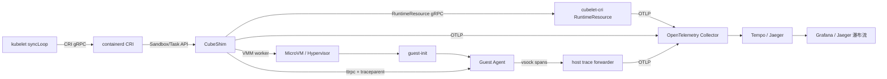

# Cube CRI 全链路 Tracing 方案

> 状态：方案草案，待评审
> 范围：从 kubelet `syncLoop`/CRI 调用进入 Cube runtime，到 MicroVM 内所有容器完成启动或 Pod Ready 被观察到
> 目标后端：OpenTelemetry Collector + Tempo、Jaeger 或其他兼容 OTLP 的 tracing 后端

## 1. 结论

当前 Cube CRI 架构可以做全链路 tracing，但不能只依赖现有代码直接得到标准瀑布流。

现状是：

- Cubelet/CubeShim/Agent 已有较多耗时点和本地 trace 能力。
- Guest Agent 已使用 Rust `tracing` + OpenTelemetry，并支持从 ttrpc metadata 提取 W3C trace context。
- Cubelet 的 `CUBE_PERF_TRACE=1` 会输出 `cube_perf` 本地耗时日志。
- CubeLog 的 `RequestTrace` 是扁平耗时日志，不是 OTel span 树。
- Cube CRI 监控栈当前以 Prometheus/Grafana 指标为主，没有 OTLP tracing 出口。

因此推荐按“先打通 CRI 到 Guest Agent，后补 kubelet syncLoop”的顺序推进。首期即可用标准 tracing 前端渲染 Cube 内部瀑布流；要覆盖 kubelet `syncLoop` 的真实内部阶段，需要 kubelet 原生埋点、CRI 代理或 eBPF/日志关联方案配合。

## 2. 边界与定义

### 2.1 起点

全链路有两个可选起点：

| 起点 | 覆盖范围 | 可行性 |
|---|---|---|
| `RunPodSandbox`/`CreateContainer`/`StartContainer` CRI 请求入口 | 覆盖 Cube CRI 内部完整路径 | 首期推荐 |
| kubelet `syncLoop` 开始处理 Pod | 覆盖 kubelet 调度、PLEG、状态上报和 CRI 调用前等待 | 需要 kubelet 侧改造或旁路关联 |

Cube runtime 无法从未改造的 kubelet 自动获得 `syncLoop` 内部 span。CRI 请求也不会天然携带来自 kubelet `syncLoop` 的 trace context。

### 2.2 终点

“MicroVM 内所有 container ready”需要区分两层语义：

| 终点 | 含义 | 归属 |
|---|---|---|
| 所有容器进程已在 Guest 内启动 | Agent 完成 `CreateContainer`/`StartContainer`，进程进入 running | Cube CRI 可直接覆盖 |
| Kubernetes Pod Ready condition 为 true | kubelet 已完成状态计算和 readiness probe 判定 | 需要 kubelet 或 Pod status watcher 参与 |

首期建议以“所有业务容器在 Guest 内启动完成”作为 trace 主终点，同时用异步事件关联 Pod Ready condition。这样既能定位 Cube 快路径瓶颈，又不把 kubelet probe 语义混入 Cube 内部耗时。

## 3. 现有能力

### 3.1 Cubelet

`Cubelet/services/runtime/service.go` 的 `PrepareSandbox` 已有 request-local `monotime.TraceBuffer`，在 `CUBE_PERF_TRACE=1` 时输出以下阶段：

- `operation_lock`
- `digest`
- `coordinator`
- `adapter`
- `validate`
- `mark_ready`

`Cubelet/internal/monotime/trace.go` 将耗时点延后 flush，适合迁移为 OTel span event 或 child span。

### 3.2 CubeShim

CubeShim 在 Sandbox Service 和 Task Service 中已有关键耗时日志：

- `CreateSandbox`
- `StartSandbox`
- `TaskCreate`
- `TaskStart`
- Agent `CreateContainer`
- Agent `StartContainer`

这些点目前主要通过日志、`cube_perf` 或内部 metric 记录，没有统一 trace context，也没有 OTLP exporter。

### 3.3 Guest Agent

Guest Agent 已具备较好的 OTel 基础：

- `agent/src/tracer.rs` 设置 `TraceContextPropagator`。
- `trace_rpc_call!` 从 ttrpc metadata 提取 trace context 并设置 parent span。
- `agent/src/rpc.rs` 对 `create_container`、`start_container` 等 RPC 建 span。
- `agent/vsock-exporter` 可通过 vsock 将 span 送到宿主机 forwarder。

缺口是宿主机侧缺少统一 forwarder/OTLP 转发路径，且 Shim 调 Agent 时尚未系统性注入 trace context。

### 3.4 Hypervisor/VMM

Hypervisor 有本地 tracer，可输出 `cloud-hypervisor-<pid>.trace` 文件；CubeShim/VMM worker 也有启动阶段耗时日志。它们适合作为 OTel span event 的来源，但目前不是 OTel trace 的一部分。

## 4. 目标架构



核心原则：

- 使用 W3C `traceparent`/`tracestate` 作为跨进程、跨语言传播格式。
- 每个 Pod 创建产生一个 root trace，`pod_uid`、`sandbox_id`、`container_id` 作为 span attribute，不作为采样或指标高基数 label。
- 仅对 `runtimeClassName=cube` 或带调试 annotation 的 Pod 开启详细 tracing。
- tracing 失败不得影响 CRI 控制路径；exporter 必须有超时、有界队列和丢弃计数。

## 5. Trace Context 传播

### 5.1 kubelet 到 Cube CRI

首期在 Cube CRI 入口创建 root span：

- 若请求 metadata 已有 `traceparent`，则继续该上下文。
- 若没有，则以 `RunPodSandbox` 创建新的 trace。
- 用 `pod_uid + sandbox_id` 建立后续 CRI 请求与 root trace 的映射。

增强方案：

- 通过 CRI 代理包装 kubelet 到 containerd 的 Unix socket，在代理层创建 `kubelet.cri.*` span。
- 若允许改造 kubelet，则在 `syncLoop`、`SyncPod`、`generatePodSandboxConfig`、CRI runtime manager 调用处原生埋点。
- 若不改造 kubelet，则通过 Pod event、kubelet 日志和 CRI 请求时间做关联，作为非严格 parent/child event。

### 5.2 Cubelet RuntimeResource

Shim 调 RuntimeResource 时应注入 gRPC metadata：

- `traceparent`
- `tracestate`
- `x-cube-trace-source=shim`

RuntimeResource 服务端通过 gRPC interceptor 提取上下文，并为以下操作建 span：

- `runtime_resource.prepare_sandbox`
- `runtime_resource.network_prepare`
- `runtime_resource.persist_stage`
- `runtime_resource.mark_ready`
- `runtime_resource.release_sandbox`
- `runtime_resource.open_tap`

已有 `TraceBuffer` 阶段可以先作为 span event 接入，后续再拆成 child span。

### 5.3 containerd/OCI 到 Shim

从 CRI 到 Shim 的传播建议双通道：

- ttrpc metadata：用于 Sandbox/Task API 请求内传播。
- OCI annotation：作为重启、恢复、异步任务和 Agent 请求的兜底上下文。

推荐 annotation：

| Key | 用途 |
|---|---|
| `io.cubesandbox.trace.traceparent` | W3C `traceparent` |
| `io.cubesandbox.trace.tracestate` | W3C `tracestate` |
| `io.cubesandbox.trace.root_operation` | `pod-start`、`container-start` 等 |
| `io.cubesandbox.trace.sampled` | 是否采样，便于 Shim 快速短路 |

Shim 收到请求后优先使用 metadata；metadata 缺失时从 OCI annotation 恢复。

### 5.4 Shim 到 Guest Agent

Guest Agent 已支持从 ttrpc metadata 提取 trace context，因此 Shim 侧需要在 Agent client wrapper 里统一注入：

- `CreateSandbox`
- `CreateContainer`
- `StartContainer`
- `ExecProcess`
- `StatsContainer`
- `UpdateContainer`
- `DestroyContainer`

不要在每个调用点手写注入逻辑，应封装到 Agent client 构造或调用 wrapper，避免遗漏。

### 5.5 MicroVM boot 阶段

MicroVM 启动早期无法由 Guest Agent 主动接收 trace context，因此由 Shim/VMM worker 记录为 `microvm.boot` span 下的 events：

- VMM worker fork/exec
- VM create
- memory/rootfs/virtiofs/vsock/net device ready
- guest-init ready
- cube-agent started
- vsock server ready

这些事件由宿主侧持有同一 trace context，不依赖 guest 内 exporter。Agent 启动后再接入自己的 child span。

## 6. Span 设计

### 6.1 推荐 span 树

```text
kubelet.pod_start                可选，需 kubelet 改造或 CRI 代理
└── cri.run_pod_sandbox
    ├── runtime_resource.prepare_sandbox
    │   ├── runtime_resource.network_prepare
    │   ├── runtime_resource.persist_stage
    │   └── runtime_resource.mark_ready
    ├── shim.create_sandbox
    │   ├── shim.runtime_prepare_plan
    │   ├── microvm.boot
    │   │   ├── event: vmm_worker_exec
    │   │   ├── event: vm_created
    │   │   ├── event: guest_init_ready
    │   │   └── event: agent_vsock_ready
    │   └── agent.create_sandbox
    ├── cri.create_container[0]
    │   └── shim.task_create
    │       └── agent.create_container
    ├── cri.start_container[0]
    │   └── shim.task_start
    │       └── agent.start_container
    └── pod.ready_observed         可选，来自 kubelet 或 Pod watcher
```

多容器 Pod 中，每个 container 使用独立 child span，并带 `container.name`、`container.id`、`container.role=infra|workload|init`。

### 6.2 必要 attributes

| Attribute | 说明 |
|---|---|
| `service.name` | `cubelet-cri`、`containerd-shim-cube-rs`、`cube-agent` |
| `cube.component` | `runtime_resource`、`shim`、`vmm`、`agent` |
| `k8s.pod.uid` | Pod UID |
| `k8s.namespace.name` | Namespace |
| `k8s.pod.name` | Pod name |
| `k8s.container.name` | Container name |
| `cube.sandbox.id` | Sandbox ID |
| `cube.container.id` | Container ID |
| `cube.runtime_class` | `cube` |
| `cube.node.name` | Node name |
| `cube.operation.id` | 幂等键或操作 ID |
| `error.type` | 受限错误分类 |

禁止写入 secret、token、完整命令行、镜像拉取凭证、宿主机敏感路径和未脱敏错误原文。

## 7. OTel 接入方案

### 7.1 节点侧组件

每个 Cube 节点部署：

- `otel-collector-agent`：DaemonSet 或 systemd service，监听本机 OTLP。
- `cube-trace-forwarder`：接收 Guest Agent vsock span，转换为 OTLP 后发给 collector。
- `cubelet-cri`、CubeShim、Agent：统一配置 OTLP endpoint、采样率和资源属性。

推荐本机地址：

| 组件 | 出口 |
|---|---|
| Go 组件 | `OTEL_EXPORTER_OTLP_ENDPOINT=http://127.0.0.1:4318` 或 gRPC `4317` |
| Rust Shim | OTLP exporter 指向本机 collector |
| Guest Agent | 继续使用 vsock exporter，由 host forwarder 转 OTLP |

### 7.2 Collector pipeline

Collector 至少包含：

- `otlp` receiver：接收 host 组件和 forwarder。
- `batch` processor：批量发送。
- `memory_limiter` processor：限制节点内存占用。
- `attributes/resource` processor：补充 cluster、node、runtime 信息。
- `tail_sampling` 或 head sampling：仅保留调试 Pod、错误 trace 或慢请求。
- `otlp` exporter：发往 Tempo、Jaeger 或供应商后端。

本仓库提供调试用部署入口：

```bash
task deploy:tracing
```

该任务会部署：

- `cube-cri-jaeger`：Jaeger all-in-one，提供 OTLP receiver 和瀑布流 UI。
- `cube-cri-otel-collector`：hostNetwork DaemonSet，监听每个节点本机 `4317`/`4318`，再转发到 Jaeger。

随后部署 Cube CRI 时显式开启 tracing：

```bash
helm upgrade --install cube-cri deploy/cube-cri/chart \
  --set-string tracing.otlpEndpoint=http://127.0.0.1:4318 \
  --set-string tracing.protocol=http/protobuf
```

### 7.3 采样策略

默认策略：

- 正常请求：1% head sampling。
- 失败请求：100% 保留。
- 总耗时超过阈值，如 5s：100% 保留，可用 tail sampling。
- Pod annotation `cube.cloud.tencentcloud.com/trace=true`：100% 保留。
- 非 Cube runtime：不采样或只采 kubelet/CRI 代理入口。

### 7.4 当前落地状态

当前代码已落地首批 opt-in 能力：

- `cubelet-cri` 新增 `Cubelet/pkg/oteltrace`，仅在配置 OTLP endpoint 后初始化 OTel exporter。
- RuntimeResource gRPC server 接入 `otelgrpc` server handler。
- `PrepareSandbox` 增加 `operation_lock`、`digest`、`coordinator_prepare`、`adapter_prepare`、`validate`、`mark_ready` 阶段 span。
- CubeShim 从 containerd ttrpc metadata 提取 `traceparent`、`tracestate`、`baggage`。
- Shim 调 RuntimeResource 时把 trace context 注入 gRPC metadata。
- Shim 调 Agent `CreateContainer`、`StartContainer` 时把 trace context 注入 Agent ttrpc metadata。
- 新增 host `cube-trace-forwarder`，监听 Agent 默认 vsock port `10240`，解码 Agent `SpanData` 并转发到 OTLP 后端。
- 新增 `cube-cri-trace-proxy`，在不 patch containerd 的前提下代理 CRI gRPC，并把 `RunPodSandbox`、`PodSandboxStatus`、`CreateContainer`、`StartContainer` 通过本机 trace context bridge 合成同一棵 trace。
- `deploy/cube-cri` 新增 tracing Helm values，默认关闭；`tracing.otlpEndpoint` 非空时才写入环境变量。
- containerd 使用官方 `OTEL_*` 环境变量，不维护 containerd patch。
- runtime 安装包已包含 `cube-trace-forwarder`；仅当 `tracing.otlpEndpoint` 非空时安装并启动 `cube-cri-trace-forwarder.service`，关闭 tracing 时会停用该服务。
- `task deploy:tracing` 可部署 node-local OTel Collector 与 Jaeger，宿主组件使用 `http://127.0.0.1:4318` 即可导出。
- 已在测试集群实测：创建新 Pod 后，Jaeger 可实时看到同一 trace tree，包含 `RunPodSandbox`、containerd CRI span、RuntimeResource `PrepareSandbox` 阶段 span、`PodSandboxStatus`、`CreateContainer` 和 `StartContainer`。

实测限制：

- 测试集群 containerd `1.7.28-tke.3` 能导出 CRI gRPC span，但 runtime v2 shim client 未接入 `otelttrpc` 或 `otelgrpc` client handler，CRI span 的 trace context 不会自动传到 CubeShim。
- `github.com/containerd/containerd/v2 v2.2.2` 模块已包含 runtime v2 shim client 的 `otelttrpc.UnaryClientInterceptor()`，升级到该路径后可走标准传播；containerd `1.7` 当前通过 CRI proxy 与本机 trace context bridge 规避。
- Agent 侧已有 vsock exporter 代码路径，但本次验收未在 Jaeger 中观察到独立 agent service，暂不把 Agent 内部 span 计入已落地范围。

尚未落地：

- CubeShim 自身的 Rust OTel exporter 和手工 span。
- Agent 内部 span 的端到端可见性验收。
- Pod Ready watcher 与 kubelet `syncLoop` 侧 span。

## 8. 实施步骤

### 阶段 1：Cube 内部最小闭环

目标：`RunPodSandbox` 到 Agent `StartContainer` 可以在 Tempo/Jaeger 看到一条完整 trace。

工作项：

- 在 `cubelet-cri` 初始化 Go OTel SDK、gRPC interceptor 和资源属性。
- 在 RuntimeResource 服务端提取/创建 trace context。
- 在 CubeShim 增加 Rust OTel SDK 和 ttrpc/gRPC context 注入工具。
- Shim 调 Agent 时注入 `traceparent`。
- 部署本机 OTel Collector 和 Guest vsock forwarder。
- 新增 `trace=true` Pod annotation，控制单 Pod 详细采样。

验收：

- 创建单容器 Pod，标准前端可看到 RuntimeResource、Shim、VMM boot、Agent create/start 的瀑布流。
- Collector 停止或后端不可用时，Pod 创建仍成功。
- trace 中无 secret、token、命令行敏感内容。

### 阶段 2：多容器与 Ready 关联

目标：多容器 Pod 可区分每个 container，并能关联 Pod Ready。

工作项：

- 用 `pod_uid + container_name` 关联 CRI `CreateContainer`/`StartContainer`。
- init container、sidecar、infra container 使用明确 attribute。
- 增加 Pod status watcher，将 `Ready=True` 写为 root trace event 或独立 linked span。
- 对 readiness probe 失败场景记录事件，但不把 probe 逻辑放入 Cube 内部 span。

验收：

- 多容器 Pod 的瀑布流清晰展示容器并发/串行关系。
- Pod Ready 事件时间可与 Agent start 完成时间对比。

### 阶段 3：kubelet syncLoop 覆盖

目标：覆盖 kubelet 内部等待和调度阶段。

可选路径：

| 路径 | 优点 | 缺点 |
|---|---|---|
| 改造 kubelet | span 语义最准确 | 需要维护 kubelet patch |
| CRI 代理 | 不改 kubelet，能覆盖 CRI 请求边界 | 看不到 syncLoop 内部阶段 |
| eBPF/日志关联 | 入侵最小 | 只能做近似关联，不是严格 parent/child |

推荐先做 CRI 代理，再评估是否需要 kubelet patch。对 AGC 内部可控集群，如果已有 kubelet 发布链路，最终可以在 kubelet `syncLoop` 和 runtime manager 周围加原生 span。

## 9. 风险与约束

- 高并发下 tracing 可能放大 CPU、内存和网络开销，必须默认低采样。
- trace context 映射表要设置 TTL，避免 Pod 删除后泄漏。
- Shim 是短生命周期进程，exporter flush 必须设置短超时，不能阻塞退出。
- Guest Agent 到宿主的 vsock exporter 不应直连中心 collector，避免 guest 网络和鉴权复杂化。
- Pod Ready 属于 kubelet 语义，Cube CRI 只能直接保证 Guest 内进程启动状态。
- OTel SDK 版本需按组件语言分别评估，避免引入过大依赖或与现有 containerd 依赖冲突。

## 10. 测试与验证

单元测试：

- trace context 注入/提取。
- OCI annotation 兜底恢复。
- 采样开关和 annotation 覆盖。
- exporter 失败、队列满、collector 不可用时不阻塞主流程。

集成测试：

- 单容器 Pod 创建。
- init container + 多业务容器。
- Agent `CreateContainer` 失败。
- VMM boot 超时。
- Collector 重启和后端不可用。

集群验收：

- 使用 `task test:cri` 验证 Pod 启动、init、卷、探针、日志和 exec。
- 在 TS4/PVM cube 节点创建带 trace annotation 的 Pod。
- 在 tracing 前端确认 waterfall 可按 `pod_uid`、`sandbox_id` 查询。
- 对比 Prometheus 指标、Cube 本地日志和 trace 时间线，确认阶段顺序一致。

## 11. 首期改动清单

建议首期最小改动：

1. 新增 `pkgs/otel` 或 `Cubelet/pkg/oteltrace`，封装 Go OTel 初始化、metadata 注入/提取、采样配置。
2. Cubelet RuntimeResource gRPC 服务增加 interceptor。
3. CubeShim 增加 `trace_context` 模块，封装 ttrpc/gRPC metadata 与 OCI annotation。
4. Shim Agent client wrapper 统一注入 trace context。
5. 增加 host `cube-trace-forwarder`，接收 agent vsock exporter 并转 OTLP。
6. `deploy/cube-cri` 增加 tracing 配置项，默认关闭。
7. `deploy:monitoring` 或独立脚本增加 OTel Collector、Tempo/Jaeger 示例部署。

完成首期后，Cube CRI 内部的主要耗时路径即可用标准 tracing 前端渲染成瀑布流。kubelet `syncLoop` 的精确覆盖作为第二阶段评估，不阻塞 Cube runtime 内部 tracing 落地。
