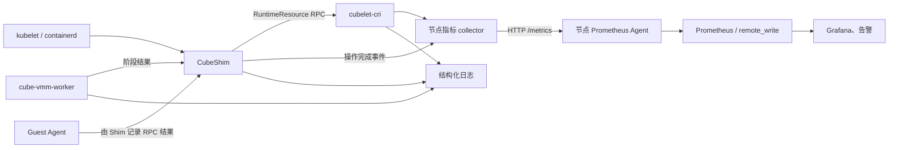

# Cube CRI 运行时监控方案

> 状态：已在测试集群实施，待评审
> 范围：`cubelet-cri`、CubeShim、VMM worker 和 Shim 发起的 Guest Agent 调用
> 不替代：kubelet、containerd、节点 OS、业务容器现有监控

## 1. 背景与结论

当前 Cube CRI 没有统一 Prometheus 监控链路。`cubelet-cri` 只提供 RuntimeResource 和 FD handoff；CubeShim 将部分耗时和错误写入本地 `cube-shim-stat.log`，不会被 `cubelet-cri` 汇总或由 Prometheus 抓取。

本方案以每节点一个 `cubelet-cri` `/metrics` 端点作为 Cube CRI 指标出口。`cubelet-cri` 直接记录自身 RPC 和节点资源操作；CubeShim 的控制路径在操作完成后通过受限的 Unix datagram 提交单条观测事件，其中包含 VMM worker 启动阶段。Prometheus 只抓取节点端点，不发现或抓取短生命周期 Shim。

验证栈还抓取 Cube 节点 kubelet 的 Pod 启动直方图，用于区分 kubelet 排队/状态上报与 Cube CRI 内部阶段；具体 Pod 的根因仍通过 sandbox ID 关联结构化日志和诊断接口定位。

## 2. 目标与非目标

### 目标

- 以秒级粒度查看创建、启动、停止、删除路径的吞吐、错误率、P50/P95/P99 和并发。
- 识别网络准备、共享目录、状态持久化、锁等待、VMM 启动和 Agent 调用造成的瓶颈。
- 发现清理队列积压、状态采样异常和指标上报丢失。
- 不在指标 label 中引入 Pod UID、sandbox ID、container ID、错误原文或文件路径。
- 监控失效或 collector 过载时，不阻塞 CRI 控制路径。

### 非目标

- 不以指标保存单 Pod 的完整调用链或审计记录。
- 不重复 kubelet、containerd、node-exporter、cAdvisor 的既有 CPU、内存和镜像指标。
- 首期不提供 OpenTelemetry trace；统一 request ID 和 tracing 后续单独推进。
- Guest 工作负载 CPU、内存、I/O 指标沿用现有 Cubelet 资源指标链路，见[沙箱资源指标](../guide/resource-metrics)。

## 3. 架构与数据流



`cubelet-cri` 内置 collector，监听两类输入：

| 来源 | 采集方式 | 采集内容 |
|---|---|---|
| `cubelet-cri` | 进程内埋点 | RuntimeResource RPC、资源准备/释放、网络、状态持久化、锁等待、reaper |
| CubeShim | Unix datagram 事件 | Sandbox/Task 生命周期、Agent RPC、Shim 内部错误 |
| VMM worker | CubeShim 控制路径的 Unix datagram 事件 | worker 拉起、placement、VM 创建、boot、退出 |
| 后台状态采样 | 定时缓存 | 各 lease phase 数量、reaper 积压及最老任务时间 |

Prometheus 抓取只读取内存中的 Counter、Histogram 和最近一次后台快照；不得在 `/metrics` 请求中读取磁盘、遍历运行中 Pod、调用 Agent 或执行 RuntimeResource RPC。

## 4. Shim 到 cubelet-cri 的指标链路

### 4.1 事件模型

Shim 不周期性推送完整指标快照。其 VMM worker 控制路径及关键操作结束后发送一个非阻塞事件：

```json
{
  "version": 1,
  "component": "vmm",
  "operation": "BootVm",
  "result": "ok",
  "duration_seconds": 1.42
}
```

collector 将事件累加为 Counter 和 Histogram。首期事件失败统一归为 `internal`；后续再按 `kvm`、`network`、`state`、`agent`、`timeout`、`cgroup`、`validation` 等有限类别细分。

Shim 仅在操作结束时上报，因此不为正常请求增加周期性网络或磁盘开销。首期不发送心跳，也不暴露易受进程回收影响的 Shim/worker 数量 Gauge。

### 4.2 传输契约

使用节点本地 Unix datagram socket，例如 `/run/cube-cri/metrics.sock`。它与 RuntimeResource 控制 socket 分离，避免监控背压、collector 升级或协议变更影响 `PrepareSandbox`、`ReleaseSandbox` 和 FD handoff。

- 每个 datagram 是一条不超过 1 KiB 的版本化 JSON 或 protobuf 事件。
- 发送端使用有界队列和非阻塞发送；队列满、socket 不可用或格式化失败时丢弃事件并在下一条成功事件附带累计丢弃数。
- socket 由 root 创建并设为 `0600`；Shim 在 root 上下文写入。若后续支持非 root 发送端，必须增加 `SO_PASSCRED` 校验。
- collector 对 `component`、`operation`、`result`、`error_class` 采用 allowlist 校验，拒绝未知值并记录拒绝计数。
- 事件不携带 ID、Pod 元数据、路径、命令行、错误原文或 Secret。

Unix datagram 是监控数据面，不提供确认、重试或持久化。进程崩溃和 collector 重启期间少量观测可能丢失；仪表盘必须展示 `cube_cri_metric_events_dropped_total`，不能把指标当作审计证据。

## 5. 指标设计

所有指标使用 `cube_cri_` 前缀，单位遵循 Prometheus 命名约定。Histogram 的桶建议覆盖 `100us` 至 `120s`，重点观察 10ms、100ms、1s、5s、30s 和 60s。

### 5.1 核心指标

| 指标 | 类型与 label | 含义 |
|---|---|---|
| `cube_cri_operations_total` | Counter：`component,operation,result` | 已完成内部操作数 |
| `cube_cri_operation_duration_seconds` | Histogram：`component,operation,result` | 内部阶段耗时；嵌套阶段可重叠，不能相加 |
| `cube_cri_operation_failures_total` | Counter：`component,operation,error_class` | 按受限错误类别统计的失败数 |
| `cube_cri_operations_inflight` | Gauge：`component,operation` | 正在执行的操作数 |
| `cube_cri_lock_wait_duration_seconds` | Histogram：`lock` | 等待 sandbox 互斥锁、adapter 锁等的时间 |
| `cube_cri_rpc_requests_total` | Counter：`method,code` | RuntimeResource RPC 的 gRPC 结果 |
| `cube_cri_rpc_duration_seconds` | Histogram：`method` | RuntimeResource RPC 端到端耗时，包含锁等待 |
| `cube_cri_resource_leases` | Gauge：`phase` | 最近一次采样得到的 PREPARING、READY、RELEASING lease 数 |
| `cube_cri_reaper_pending_jobs` | Gauge | 待清理的持久化任务数 |
| `cube_cri_reaper_oldest_job_timestamp_seconds` | Gauge | 最老待清理任务的修改时间；队列为空时为 0 |
| `cube_cri_state_collection_success` | Gauge | 最近一次状态采样是否成功 |
| `cube_cri_state_collection_timestamp_seconds` | Gauge | 最近一次成功状态采样时间 |
| `cube_cri_metric_events_total` | Counter：`result` | Shim/worker 事件的 `accepted`、`invalid`、`unauthorized` 数 |
| `cube_cri_metric_events_dropped_total` | Counter | Shim/worker 报告的本地丢弃事件数 |

`result` 仅允许 `ok`、`error`、`canceled`。`component` 初期仅允许 `resource`、`shim`、`vmm`、`agent`；`operation` 必须是代码中注册的有限集合。

### 5.2 首期操作集合

| 组件 | 操作 |
|---|---|
| `resource` | `Prepare`、`Release`、`NetworkPrepare`、`NetworkRelease`、`Persist`、`SharedRootCleanup`、`ReaperScan`、`Inspect` |
| `shim` | `CreatePodSandbox`、`TaskCreate`、`TaskStart`、`StartSandbox`、`StopSandbox`、`ShutdownSandbox`、`CreatePodContainer`、`Start`、`DeleteContainer`、`Exec`、`Stats` |
| `vmm` | `prepare-intent`、`fork-exec`、`hello`、`fd-gate`、`placement`、`LaunchVmm`、`CreateVm`、`BootVm` |
| `agent` | `Connect`、`CreateSandbox`、`CreateContainer`、`StartContainer`、`Exec`、`Stats`、`Update`、`DestroyContainer` |

VMM worker 已有的阶段耗时日志可作为首期事件名称来源。对外指标名称和 label 值一经发布应视为兼容契约。

## 6. Prometheus 采集与安全

### 6.1 端点与部署

`cubelet-cri` 增加独立 HTTP 监听器，默认监听 `:10098` 并仅提供 `/metrics`。生产环境应由同节点 Prometheus Agent 抓取 loopback 端点后 `remote_write` 到中心 Prometheus；本项目的验证 IAC 为独立 Prometheus 通过节点管理网抓取该端口，并以 10Gi `ReadWriteOnce` PVC 保存 24 小时数据。

没有节点 Agent 时，可显式绑定节点管理网 IP，并用安全组或节点防火墙仅允许 Prometheus 网段访问。端点不提供业务鉴权和 TLS，不得暴露到 Pod 网、公网或通用反向代理。

建议抓取配置：

```yaml
- job_name: cube-cri
  scrape_interval: 15s
  scrape_timeout: 5s
  metrics_path: /metrics
  static_configs:
  - targets: [127.0.0.1:10098]
```

实际集群应通过节点发现或每节点 Agent 的静态 loopback target 生成目标列表，并保留 `node`、`cluster`、`runtime=cube` 等外部 label；这些 label 由采集配置注入，不由运行时接受。

### 6.2 资源边界

- collector 的事件接收和 `/metrics` 响应均设置并发上限。
- 后台状态采样默认 15 秒，失败后保留上一次完整值，并暴露采样状态和时间。
- 指标总数仅随节点数量和固定操作集合增长，不随 Pod、container、namespace 数量增长。
- Prometheus scrape 失败不反向影响 Cube CRI；collector 不可用时 Shim/worker 静默丢弃监控事件。

## 7. 看板、告警与排障

### 7.1 看板

Grafana 看板按以下顺序排障：

1. 运行概览：Sandbox 创建总耗时、kubelet Pod 启动 P95 和成功/失败速率。kubelet 指标覆盖 kubelet 首次看到 Pod 到 Running，以及从创建到 ContainersStarted 的路径。
2. 节点资源与网络：`Prepare`、`NetworkPrepare` 的 P50/P95/P99、结果速率和 sandbox 锁等待。
3. VMM worker：worker 启动阶段与 `LaunchVmm`、`CreateVm`、`BootVm` 的 P95 和结果速率。
4. Guest Agent 与任务创建：`CreateSandbox`、`CreateContainer`、`TaskCreate`、`TaskStart`、`StartContainer` 的分位延迟和结果速率。
5. 释放、恢复与状态：`Release`、`NetworkRelease`、共享目录清理、lease phase 与 reaper。
6. 错误定位：内部操作、受限错误类别和 RuntimeResource gRPC 错误速率。
7. 节点与采集健康：端点可达性、事件接收/丢弃、状态采样结果与年龄。

`CreatePodSandbox` 由独立观测记录，不将嵌套阶段的耗时相加。

P95 示例：

```promql
histogram_quantile(0.95,
  sum by (le, component, operation) (
    rate(cube_cri_operation_duration_seconds_bucket[5m])
  )
)
```

操作错误率示例：

```promql
sum by (component, operation) (rate(cube_cri_operations_total{result="error"}[5m]))
/
sum by (component, operation) (rate(cube_cri_operations_total[5m]))
```

### 7.2 初始告警

阈值应以一周基线为准，以下仅作为首批保守告警：

| 告警 | 条件 | 处理方向 |
|---|---|---|
| CubeCRI 指标不可达 | `up{job="cube-cri"} == 0` 持续 5 分钟 | 检查服务、端口、节点 Agent 和网络策略 |
| 启动失败率高 | `CreatePodSandbox` 或 `StartSandbox` 5 分钟错误率超过 2% 且请求数不少于 10 | 按 `error_class`、Shim 日志和 containerd 事件定位 |
| 启动 P95 退化 | 任一关键启动阶段 P95 连续 10 分钟超过基线 2 倍 | 对比锁等待、网络、VMM、Agent 阶段 |
| 清理积压 | `cube_cri_reaper_pending_jobs > 0` 持续 10 分钟，或最老任务超过 15 分钟 | 检查 Release、挂载、TAP、CNI 和节点磁盘状态 |
| 采样失效 | `time() - cube_cri_state_collection_timestamp_seconds > 60` | 检查状态目录权限、磁盘 I/O 和 collector 日志 |
| 事件丢失 | 5 分钟内 `cube_cri_metric_events_dropped_total` 增长 | 检查 collector 负载、socket 权限、Shim 本地队列 |

## 8. 日志与诊断关联

指标只回答“哪个节点、哪个阶段、何时开始异常”。具体错误必须保留在结构化日志中，并包含 `sandbox_id`、`container_id`、`request_id`、操作、阶段、错误类别、gRPC code 和原始错误。

首期可以按节点、时间窗口和 operation 关联日志。后续为 kubelet 请求、containerd sandbox/task、CubeShim、VMM worker、RuntimeResource、Agent 传递统一 `request_id`；再按需要接入 trace 后端。不得将 request ID 放入 Prometheus label。

## 9. 分阶段实施与验收

| 阶段 | 交付 | 验收 |
|---|---|---|
| P1 | `cubelet-cri` `/metrics`、RuntimeResource RPC 与资源 adapter 指标、后台状态采样 | 单节点 curl 可见指标；Prometheus 成功抓取；并发 Prepare/Release 不回归 |
| P2 | Shim/VMM 事件 socket、固定操作与错误类别、丢弃观测 | 人工制造 VMM/网络/Agent 错误后，Counter、Histogram 和日志一致；collector 不可用时 Pod 仍可创建 |
| P3 | 节点 Agent 抓取配置、Grafana 看板、初始告警规则 | 集群压测可区分锁等待、网络、VMM 和 Agent 瓶颈；告警可链接到节点日志 |
| P4 | 统一 request ID、Agent 内部细分指标、可选 tracing | 单 Pod 可从 kubelet 请求关联到 Agent 末端阶段 |

每个阶段必须执行以下验证：

- 正常 Pod 创建、init/app/sidecar、删除和重启的指标结果正确。
- 注入网络、KVM、Agent、状态持久化和清理失败，错误类别不产生无界 label。
- 高并发创建时比较启用/关闭监控的端到端延迟，确认指标发送不阻塞控制路径。
- 停止 collector、阻塞 Prometheus 抓取、填满 Shim 事件队列后，Pod 生命周期保持正确，丢失情况可观测。
- 在 TS4 测试节点运行 `task test:cri` 和 `task test:e2e-framework` 的针对性用例。

## 10. 验证环境 IAC

Grafana 面板和独立 Prometheus 由 `deploy/grafana/` 中的 Go 生成器定义，生成文件为 `deploy/kubernetes/cube-cri-monitoring/monitoring.yaml`。生成器和产物一致性通过 `go run ./cmd/grafanacfg -check` 校验；部署命令为：

```bash
task deploy:monitoring
```

面板按总览、Pod 创建路径、回收与节点状态、监控链路健康排列，只使用时序图和 `rate()`，不使用 `stat` 或 `increase()`。

## 11. 后续决策项

以下事项需在生产推广前确认：

1. 是否以节点 Prometheus Agent 抓取 `127.0.0.1:10098` 作为标准部署，还是允许中心 Prometheus 直接访问节点端口。
2. Shim/worker 指标事件采用 JSON 还是 protobuf；两者均需版本号和固定 allowlist。
3. 首期是否包含 Agent 内部埋点，还是先将 Shim 记录的 Agent RPC 时延作为 Agent 阶段指标。
4. 启动时延、错误率和 reaper 积压的正式 SLO/告警阈值，以及其基线采集周期。
