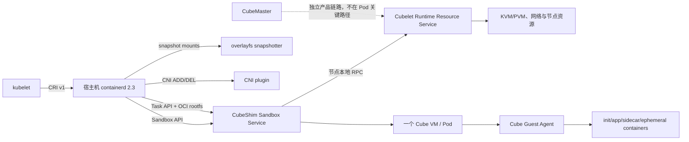
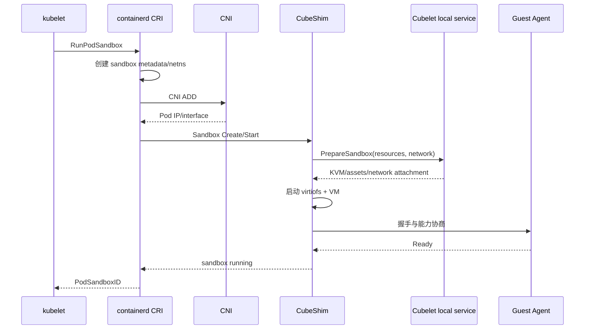
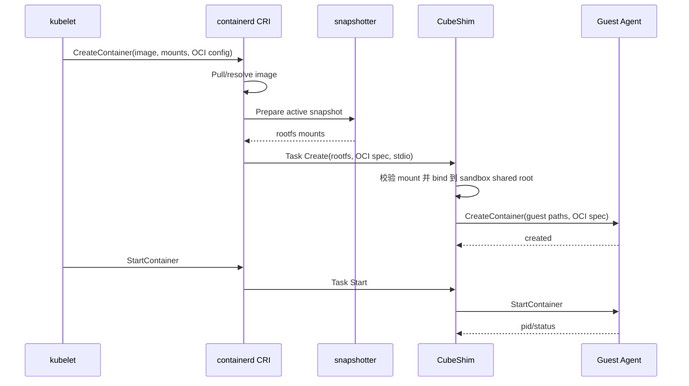

# CubeSandbox 对接 Kubernetes RuntimeClass 总体技术方案

> 状态：PoC 评审基线；主方向已确认，技术假设由 S0 探针收敛  
> 日期：2026-08-30  
> 目标：让 Kubernetes 通过 `RuntimeClass` 使用 CubeSandbox；一个 Pod 对应一个 Cube VM，Pod 内全部 init container、业务容器与 sidecar 共享该 VM。
> 开发计划：[Kubernetes RuntimeClass PoC 开发计划](./kubernetes-runtime-integration-development)

## 1. 结论摘要与 PoC 设计基线

首版保留 kubelet 与宿主机 containerd 的标准 CRI 链路，不把 Cubelet 实现成另一套 CRI，也不在 Guest 中再运行 containerd。CubeShim 同时实现 containerd Sandbox API 和 Task API，由 containerd 负责 OCI 镜像、快照、CNI、日志入口和 CRI 语义；Cubelet 只提供节点本地的 Cube VM 资源控制能力；Guest Agent 负责 VM 内容器生命周期。

```text
kubelet -> host containerd CRI -> CubeShim v2 -> Cubelet local service -> Cube VM/Agent
```

以下选择作为 PoC 设计基线，由对应 Stage 的实测证据验证：

| # | 推荐选择 | 原因 |
|---|---|---|
| D1 | 使用 containerd Sandbox API，runtime 配置 `sandboxer = "shim"` | Sandbox API 是 containerd 为微虚机和成组容器提供的边界；避免用 pause 容器进程承载 VM 生命周期 |
| D2 | 保留 runtime type `io.containerd.cube.rs` | 当前代码与部署已采用该名称；它仍然是 Shim v2，不需要因后缀改名 |
| D3 | 标准 `CreateTaskRequest.rootfs` 是 Kubernetes 路径的权威 rootfs 输入 | 兼容 overlayfs 及未来 remote snapshotter，移除 Kubernetes 路径对 `cube.rootfs.info` 私有注解的依赖 |
| D4 | 每个 Sandbox 启动一个固定 virtiofs 共享根目录，容器和卷的动态 bind mount 放在其下 | VM 只需启动一次 virtiofs；后创建 init、sidecar 或 ephemeral container 不需要重启 VM |
| D5 | PoC 使用固定 VM 规格；生产版通过准入组件把 Pod 聚合资源写入 Sandbox 注解 | CRI 的 `RunPodSandbox` 早于各容器 `CreateContainer`，Shim 当时拿不到完整容器资源请求 |
| D6 | PoC 首选 Cilium，网络适配层同时为 TKE VPC-CNI 与 Global Router 留接口 | 先验证标准 netns/CNI 与 veth 数据面；云网络差异隔离在适配层 |
| D7 | 快照、恢复和暂停放到二期；先实现“从快照创建新 Pod”，再处理长时间原地暂停 | Kubernetes 没有原生 Pod 暂停语义，长暂停会与探针、控制器和 Service 端点冲突 |

已确认的产品约束：

- 一个 Pod 一个 Cube VM，Pod 内所有容器共享 VM 和网络。
- 宿主机 containerd 完整拉取并解包标准 OCI image；首版不做镜像懒加载。
- GPU、TTY、stdin 首版可以不支持；其余本文列出的 Kubernetes 常用能力需要交付或通过明确的兼容性验证。
- 不支持 `hostNetwork`、`hostPID`、`hostIPC`；支持 Pod 内共享命名空间语义。
- 默认 runc runtime 保留，Cube 通过独立 `RuntimeClass` 选择；PoC 可以使用专用 Cube 节点。
- CubeMaster 不进入 Kubernetes Pod 创建/删除的关键路径；保留现有独立产品链路。

## 2. 目标与非目标

### 2.1 首版目标

- Kubernetes 1.36+ 可通过 `runtimeClassName: cube` 创建、停止、删除和重建 Cube Pod。
- init container、普通容器、原生 sidecar 和 ephemeral container 在同一 VM 内动态创建；它们具备独立 rootfs、进程和容器状态。
- 支持 UID/GID、supplemental groups、Linux capabilities、只读 rootfs、`no_new_privileges`，以及受节点策略控制的 privileged。
- 支持 `exec`、容器日志、生命周期 hook、startup/readiness/liveness probe、资源统计和终止宽限期；TTY/stdin 可延期。
- 支持 `emptyDir`、ConfigMap、Secret、projected volume、基础文件系统 PVC，以及受限 `hostPath`。
- 支持选定的标准 Kubernetes 网络模式、一个 Pod IP 对应一个 Cube VM、Pod 内容器共享网络。
- containerd、CubeShim 或 Cubelet 重启后能够重连存活 VM；节点重启后由 Kubernetes 重建 Pod。
- 生产验收包含多容器、PVC、升级、监控、故障恢复、兼容性和 Kubernetes Node Conformance 测试。

### 2.2 性能基线

PoC 先按以下指标设计和测量，不把它们直接视为最终 SLA：

- 单节点目标密度：100 个 Cube Pod。
- 最小规格：1 vCPU / 256 MiB 内存，不做超卖。
- 10 个并发 Pod 创建时，暖节点上的 Pod sandbox 创建 P95 目标低于 2 秒。
- 规模范围：5～100 个节点；x86_64、Linux 6.6+、KVM 必选，PVM 为可选能力。

### 2.3 首版非目标

- GPU、TTY、stdin、用户命名空间。
- `hostNetwork`、`hostPID`、`hostIPC`。
- OCI 镜像远程懒加载、P2P 镜像分发。
- 原地 VM/容器垂直资源调整保证。
- raw block PVC、完整 `subPath` 语义、双向 mount propagation、在线卷扩容。
- Pod 生命周期中的 CubeMaster 远程编排。
- 快照、恢复、暂停的生产实现；第 16 节只冻结接口和数据模型方向。

## 3. 现状判断

当前代码已经具备可复用的 VM 与 Guest 容器基础，但还不是可直接被 Kubernetes 选择的完整 runtime：

| 当前能力 | 代码现状 | Kubernetes 集成缺口 |
|---|---|---|
| VM 启动 | CubeShim 使用固定 Guest OS pmem rootfs 和独立的 `cube-agent.ext4` | 需要把 VM 生命周期提升到 containerd Sandbox API |
| Guest 容器 | Guest Agent 作为 PID 1，通过 rustjail 管理容器 | 需要完整映射 CRI/OCI 生命周期、I/O、日志、探针与退出状态 |
| 工作负载镜像 | Cubelet 可拉取 OCI 镜像，把 HostLayers/RootfsInfo 传给 Cube | Kubernetes 路径应改用 containerd 提供的标准 rootfs mount，而非私有注解 |
| 多容器 | 协议和 Agent 内部存在容器集合及动态接口 | Cubelet 当前 `Create` 是粗粒度整组创建；需要按 Sandbox/Task 动态增删 |
| 命名空间 | Agent 有 sandbox pidns 基础 | 当前创建请求把 `sandbox_pidns` 固定为 false，需按 Pod spec 正确实现 |
| virtiofs | VM 启动前确定共享目录 | Kubernetes 可在 VM 启动后创建容器与卷，需要固定共享根加动态 bind mount |
| containerd 集成 | `containerd-shim-cube-rs` 主要实现 Task Service | 需要实现稳定的 Sandbox Service，并补齐恢复、事件和状态语义 |
| 统计与快照 | 部分实现按单容器/单 writable rootfs 假设 | 多容器需要分别跟踪 cgroup、rootfs 与写层，再在 Pod 级聚合 |

因此，推荐演进现有 CubeShim 和 Agent，不新建 Cubelet CRI，也不在 Guest 中引入第二个 containerd。只有当直接 OCI 执行在 Kubernetes 兼容性验证中证明不可维护时，才重新评估 Guest containerd。

## 4. 总体架构



### 4.1 组件职责

| 组件 | 首版职责 |
|---|---|
| kubelet | 标准 CRI 调用、Pod 状态机、探针与重启策略 |
| 宿主机 containerd | CRI 实现、镜像拉取/解包、snapshotter、CNI 调用、容器 metadata 与事件路由 |
| CubeShim | 一个 sandbox shim 对应一个 Pod；实现 Sandbox/Task 服务，管理 VM、OCI spec/rootfs/volume 转译、stdio、退出事件和恢复 |
| Cubelet Runtime Resource Service | 节点本地的 VM 资产、KVM/PVM、网络设备和资源准备/释放/对账；不再调用自身内置 containerd 创建工作负载 |
| Guest Agent | 在 VM 内创建容器、命名空间和 cgroup，执行进程、挂载 rootfs/volume，采集状态与指标 |
| CNI adapter | 把 containerd 创建的 Pod netns/接口接入 VM；屏蔽 Cilium、VPC-CNI、Global Router 差异 |
| 准入组件 | 生产阶段计算 VM 聚合 CPU/内存和策略，写入受保护注解；PoC 可不部署 |

### 4.2 containerd 与 RuntimeClass 配置

建议基线配置如下，最终字段以 containerd 2.3 实机验证结果为准：

```toml
version = 3

[plugins."io.containerd.cri.v1.runtime".containerd]
  default_runtime_name = "runc"

  [plugins."io.containerd.cri.v1.runtime".containerd.runtimes.cube]
    runtime_type = "io.containerd.cube.rs"
    sandboxer = "shim"
    disable_pause_image_pull = true
    privileged_without_host_devices = true
    privileged_without_host_devices_all_devices_allowed = true
    pod_annotations = [
      "cubesandbox.io/vm-cpu",
      "cubesandbox.io/vm-memory",
      "cubesandbox.io/resource-spec-hash",
      "cubesandbox.io/restore-from",
    ]

[plugins."io.containerd.shim.v1.manager"]
  env = ["CUBE_ALLOW_PRIVILEGED=false"]
```

Cube 的 privileged 语义限定在 Guest 内：containerd 的两个
`privileged_without_host_devices*` 开关必须同时为 `true`，这样
`securityContext.privileged=true` 会产生 Guest 的 all-devices 规则，但不会自动枚举
Host `/dev`。CubeShim 还要求节点开关 `CUBE_ALLOW_PRIVILEGED=true`；未配置或设为
`false` 时，privileged 容器会在启动前得到明确拒绝，普通容器不受影响。PoC 通过
containerd shim manager 的 `env` 下发节点开关；同一 `env` 数组中不得同时出现该变量
的多个取值。生产安装器后续可把它生成到独立的 containerd import 片段中。当前实现
按 containerd 2.3 的实机输出固定输入契约：`linux.resources.devices` 必须只有一条
`allow=true`、type/major/minor 省略、`access="rwm"` 的规则；混入 deny 或重复规则都会
拒绝，避免清理规则时意外扩大原有语义。该通配规则经 Agent 转换为 Guest cgroup 的
`a *:* rwm`。

首版不为 Cube 配置专属 snapshotter；使用 containerd 的常规 overlayfs snapshotter。以后切换 remote snapshotter 时，CubeShim 仍只消费 `CreateTaskRequest.rootfs` 中的 mount 列表。

```yaml
apiVersion: node.k8s.io/v1
kind: RuntimeClass
metadata:
  name: cube
handler: cube
overhead: {} # 首版暂不声明，测量后补充
scheduling:
  nodeSelector:
    cubesandbox.io/runtime: "true"
  tolerations:
    - key: cubesandbox.io/runtime
      operator: Equal
      value: "true"
      effect: NoSchedule
```

runc 保持默认 runtime。业务 Pod 显式设置 `runtimeClassName: cube`；系统 DaemonSet 可继续使用 runc。专用节点通过 label/taint 控制范围。

### 4.3 面向社区的架构约束

实现必须沿现有 CubeShim、Cubelet 和 Guest Agent 的边界增量演进，避免为了 Kubernetes 建立一套平行 runtime：

- 不 fork Kubernetes、containerd、CRI、OCI 或 CNI 协议；优先适配稳定上游接口。
- Kubernetes API 只存在于部署/控制面和 containerd 边缘适配层，不进入 Guest Agent 或 hypervisor。
- CubeShim 负责 containerd 协议适配，Cubelet 负责节点 VM 资源，Agent 负责 Guest 内容器；不得跨层复制状态机。
- CubeMaster/CubeboxMgr legacy 链路默认保持原行为，Kubernetes 入口使用独立 feature gate 和能力协商。
- 新 RPC/字段先由接收方兼容，再由调用方启用；旧 Shim/Agent 至少能明确拒绝未知能力。
- 一个 PR 尽量聚焦一个组件，接口、重构和行为改动分开，所有跨组件依赖显式记录。

代码组织、PR 顺序、Stage 和验收标准见配套的[PoC 开发计划](./kubernetes-runtime-integration-development)。总体方案描述长期边界，开发计划记录短期实现顺序；探针若推翻假设，应先更新文档和未决问题表，再扩大实现。

## 5. Runtime 生命周期与调用时序

### 5.1 创建 Sandbox



关键原则：CNI 的权威状态仍由 containerd CRI 管理。Cube 的网络适配器只负责把已创建的 netns/接口连接到 VM，不重复分配 Pod IP。

### 5.2 创建和运行容器



init container 依次运行；原生 sidecar 的顺序和重启行为由 kubelet/CRI 驱动；普通容器和 ephemeral container 都通过同一个运行中的 sandbox shim 动态创建。

### 5.3 停止、删除与退出事件

- `StopContainer` 映射到 Guest 容器信号和宽限期；超时后强制终止。
- Agent 报告真实 exit code、时间与 OOM 状态；CubeShim 发布 containerd TaskExit 事件。
- `RemoveContainer` 卸载 Guest rootfs，再删除宿主机 sandbox shared root 下的 bind mount；containerd 最后回收 snapshot。
- `StopPodSandbox` 先停止所有剩余容器，再停 VM；`RemovePodSandbox` 执行 CNI DEL 和节点资源释放。
- 全链路操作必须可重入，使用 sandbox/container ID 作为幂等键；清理失败进入 reconcile 队列，不把半删除状态伪装成成功。

### 5.4 标准能力映射

| Kubernetes 能力 | 实现路径 |
|---|---|
| 容器日志 | CubeShim 接收 containerd 提供的 FIFO，转接 Guest stdout/stderr；保持 CRI 日志格式与 rotation 行为 |
| `kubectl exec` / probes | Task Exec -> Agent Exec；支持非 TTY exec，返回准确 exit code |
| `kubectl cp` | 通过非 TTY exec 的 tar 流实现；纳入兼容性测试 |
| lifecycle hook | kubelet 通过 exec/HTTP 调用；HTTP probe 走 Pod 网络 |
| stats | Host VM cgroup + Guest per-container cgroup/rootfs 指标，按 CRI Stats schema 返回 |
| restart policy | kubelet/containerd 重建单个容器，不重启整个 VM，除非 sandbox 已失效 |

## 6. OCI 镜像与 RootFS

Cube VM 的根文件系统是固定 Guest OS，Agent 单独启动；业务 OCI 镜像不是 VM rootfs。每个 Pod 内容器拥有独立的 OCI rootfs：

1. containerd 解析、完整拉取并解包镜像。
2. overlayfs snapshotter 为容器生成 active snapshot 和 mount 列表。
3. CubeShim 将标准 rootfs mounts 挂到该 Pod 的共享根目录。
4. virtiofs 将共享根暴露给 Guest；Agent 在容器 mount namespace 中组装 rootfs 和卷。
5. 删除容器时按 Guest unmount、Host unmount、snapshot cleanup 的顺序清理。

建议宿主机布局：

```text
/run/cubesandbox/<sandbox-id>/shared/
├── containers/<container-id>/rootfs/
├── volumes/<container-id>/<mount-id>/
├── projected/<volume-id>/
└── runtime/
```

安全要求：

- sandbox ID、container ID 必须经过白名单校验，禁止路径穿越和 symlink escape。
- 所有 source path 在 bind 前用 `openat2`/等价机制限制在允许根目录内。
- 每个 sandbox 使用独立 virtiofs 实例、socket 和共享根，不能跨 Pod 暴露目录。
- 卸载必须有引用计数和超时重试，避免删除仍被 Guest 使用的 snapshot。

现有 CubeMaster/Cubelet 独立链路可继续使用 `cube.rootfs.info`。代码内引入 `RootfsProvider` 抽象：Kubernetes provider 使用标准 mount；legacy provider 使用当前 HostLayers/私有注解，避免两个入口互相破坏。

首版标准 OCI 镜像仍需完整下载到节点。未来接入 Stargz/Nydus/overlaybd 等 remote snapshotter 时，由 containerd/snapshotter 负责懒加载；CubeShim 不识别镜像格式，只转发已经准备好的 mount，因此无需修改 CRI 和 Guest 容器模型。

## 7. Pod Namespace 与多容器语义

| Namespace/隔离域 | 首版语义 |
|---|---|
| Network | Pod 内共享，由一个 Pod IP 对应一个 VM 网络栈 |
| IPC | Pod 内共享 Guest IPC namespace；不支持 hostIPC |
| UTS | Pod 内共享 hostname/domain 语义 |
| PID | 默认每容器独立；`shareProcessNamespace: true` 时加入 Pod 共享 PID namespace |
| Mount | 每容器独立，由 Agent 构造 rootfs 与 volume mounts |
| cgroup | Guest 内每容器独立，并归属 Pod cgroup；Host 侧 VM 有独立 cgroup |
| User | 首版不支持 user namespace；执行 UID/GID 直接按 OCI spec 应用 |

VM 不是容器边界的替代品：容器仍要有独立的 mount、PID（默认）、cgroup、capability、只读 rootfs 和退出状态。Agent 必须允许 sandbox 运行后动态增加、重启和删除容器，不再把首次创建请求中的容器集合视为不可变。

## 8. 网络

### 8.1 共同模型

- containerd 创建 Pod netns 并调用 CNI ADD/DEL，CNI 负责 IPAM、路由、策略和 Kubernetes 标准语义。
- Cube 网络适配器获得 netns 路径与接口信息，把数据面接入 VM；Guest 中所有容器共享 VM 网络栈。
- Pod IP 在 VM 内可见；Service、DNS、NetworkPolicy、egress、MTU 和双栈行为由所选 CNI 方案共同验证。
- 不支持 `hostNetwork`；API 入参必须明确返回不支持，而不是静默降级。

### 8.2 PoC 选型

首选 Cilium，以 veth/tap 或等价重定向方案先跑通标准 CNI。PoC 必须实测 Cilium eBPF 程序挂载点与 VM 转发路径，确认策略对 Pod 身份和源地址仍然生效。

同时定义如下适配接口，避免把 Cilium 细节写进 Sandbox 生命周期：

```go
type PodNetworkAdapter interface {
    Attach(ctx context.Context, sandboxID, netns string, result CNIResult) (GuestNIC, error)
    Detach(ctx context.Context, sandboxID string) error
    Inspect(ctx context.Context, sandboxID string) (NetworkStatus, error)
}
```

TKE VPC-CNI 和 Global Router 各自作为 adapter 实现，在 PoC 后基于性能、策略兼容性、IP 密度和运维成本选定生产默认方案。

## 9. Volume 与存储

| 类型 | 首版范围 | 实现 |
|---|---|---|
| `emptyDir` | 支持普通磁盘目录；memory medium 需单独验证 | Host 准备目录并 bind 到 sandbox shared root，再由 Agent 挂入容器 |
| ConfigMap/Secret/projected | 支持启动时注入 | kubelet 维护 Host 侧投影目录，virtiofs 暴露；生产 conformance 前补动态更新验证 |
| 文件系统 PVC | 支持基础 CSI mounted volume | kubelet/CSI 在 Host 挂载，CubeShim 只消费 CRI mounts，不直接调用 CSI |
| `hostPath` | 仅节点 allowlist 与显式策略允许 | 规范化路径、禁止跨根和敏感目录；默认拒绝 |
| raw block | 不支持 | 二期以后评估 virtio-blk/设备透传模型 |
| `subPath`/propagation | 首版不承诺完整能力 | 安全实现和 conformance 验证后逐项开放 |

同一 Pod 多容器挂载同一个 volume 时共享同一 Host source，但每个容器保留独立目标路径和只读标记。Guest 中的 mount 操作不可扩大 Host 上 volume 的权限。

ConfigMap/Secret 的原子更新依赖 kubelet 投影目录中的 symlink 交换。PoC 允许只验证启动时内容；正式声明 Kubernetes 兼容前必须验证 virtiofs cache、inotify 和更新延迟。快照中默认不持久化 Secret 内容，恢复时由新 Pod 重新注入。

## 10. 安全

### 10.1 privileged 双门禁

只有节点配置 `CUBE_ALLOW_PRIVILEGED=true` 且 containerd 产生唯一、规范的 Guest
all-devices 标记时才允许。高 capability 特征只用于识别并拒绝配置错误，不能作为授权
依据。privileged 只提升 Guest 内权限：

- 不自动透传 Host `/dev`、Host namespaces 或任意 Host path。
- containerd 同时设置 `privileged_without_host_devices = true` 和
  `privileged_without_host_devices_all_devices_allowed = true`，避免把宿主设备加入 OCI
  spec，并显式授予 Guest 设备通配规则。
- CubeShim 在 Task reservation 和 rootfs/volume 导出前解析原始 bind source；解析失败
  即拒绝，直接 `/dev` 或解析到 `/dev` 的路径也会拒绝。解析成功后把 canonical path
  写回 OCI spec，后续导出不再复用调用方提供的符号链接。
- 需要设备的能力以后通过显式 device policy/plugin 开放；GPU 不在首版范围。
- 生产部署应由 Pod Security Admission/准入策略限制谁可以选择 Cube privileged。

### 10.2 OCI 安全字段

首版必须准确传递和执行：

- `runAsUser`、`runAsGroup`、supplemental groups、`fsGroup` 的适用语义。
- capability add/drop、ambient/inheritable/bounding 集合。
- `readOnlyRootFilesystem`、masked/readonly paths、`no_new_privileges`。
- seccomp profile；先验证 Guest 内 syscall/filter 行为，不把 Host seccomp 结果冒充 Guest 结果。

AppArmor、SELinux、user namespace 和宿主设备策略不在首版等价承诺内。若 Kubernetes 测试或用户显式配置这些能力，runtime 必须返回清晰错误或受控的不支持状态，不能静默忽略安全配置。

## 11. 资源与调度

资源控制分两层：

- Host 层：每个 Cube VM 进程进入独立 cgroup，限制 VM 总 CPU、内存和 I/O，并计入节点容量。
- Guest 层：Agent 按 OCI/LinuxResources 为每个容器建立 cgroup；Pod 级 cgroup 聚合全部容器。

### 11.1 VM 规格来源

`RunPodSandbox` 发生在容器创建之前，Sandbox API 无法天然看到所有容器 requests/limits。分两阶段处理：

- PoC：专用节点固定 `1 vCPU / 256 MiB`，仅运行符合该规格的测试 Pod，无超卖。
- 生产：Mutating Admission Webhook 读取完整 Pod spec，将聚合 CPU、内存、QoS 和 spec hash 写入受保护注解；containerd 将白名单注解传给 CubeShim。

聚合策略要覆盖 init container 的峰值规则、app+sidecar 的并发总和和 sandbox/Guest OS reserve。Webhook 与 Shim 共享版本化算法；Shim 校验 hash 和节点上限，防止用户伪造大规格。`RuntimeClass.overhead` 在实测 Guest OS、virtiofs 和 shim 固定成本后补充。

生产前需要定义：OOM 归因、Guest 与 Host 双层限额一致性、CPU quota/weight、QoS class、eviction 信号和资源统计误差。首版不保证原地 vertical resize；规格变化由重建 Pod 生效。

## 12. 恢复、可观测性、安装与升级

### 12.1 恢复模型

| 故障 | 期望行为 |
|---|---|
| containerd 重启 | 从持久状态发现 sandbox shim，重连 shim socket，不重建 VM |
| CubeShim 崩溃 | 新 shim 读取 sandbox 状态并连接仍存活的 VM/Agent；无法验证身份时 fail closed |
| Cubelet 重启 | 对账 Host VM、tap/virtiofs 和 sandbox lease，恢复节点本地控制连接 |
| Guest Agent 断连 | 指数退避重连；超过阈值将 sandbox 标记 NotReady/失败，由 kubelet 重建 |
| 单容器退出 | 产生准确 TaskExit；kubelet 按 restart policy 只重建该容器 |
| 节点重启 | 首版不恢复旧 VM；清理残留状态并由 Kubernetes 控制器重建 Pod |
| CNI/volume 清理失败 | 保留 tombstone，后台 reconcile；操作幂等且可观测 |

节点本地持久状态至少记录 sandbox/container ID、VM PID/API socket、Agent identity、virtiofs socket、共享根、网络 attachment、mount 引用和状态版本。状态文件必须原子更新，不能包含 Secret 数据。

### 12.2 可观测性

统一输出 Prometheus 指标和结构化日志，关键维度使用 sandbox/container ID，但避免用 Pod UID 等高基数字段作为无界 label。至少包括：

- sandbox/VM 创建阶段耗时、成功率和失败原因。
- 当前 VM/容器数、启动并发、KVM/PVM 失败、Agent 重连次数。
- image/snapshot mount、virtiofs、CNI attach、volume mount 的耗时和错误。
- Host VM 与 Guest container 的 CPU、内存、I/O、OOM 和 rootfs 用量。
- 残留 sandbox、mount、tap、socket、tombstone 和 reconcile 结果。

日志需在 kubelet request、containerd sandbox/task、CubeShim、Cubelet、Agent 之间传递统一 trace/request ID。提供 `cubectl inspect <sandbox-id>` 或等价诊断命令，输出脱敏后的组件状态和能力协商结果。

### 12.3 安装与升级

- 以 DaemonSet/节点安装器部署 CubeShim 二进制、Cubelet 服务、Guest assets、containerd 配置片段、RuntimeClass 和节点标签。
- 修改 containerd 配置前做语法验证和备份；不能覆盖用户已有 runtime、registry、snapshotter 配置。
- 二进制/协议先向后兼容一个版本：先升级 Agent assets/Cubelet，再升级 Shim，最后滚动节点。
- 节点升级使用 cordon/drain；首版不做 VM live migration。回滚时 runc 仍为默认，删除/禁用 RuntimeClass 即可停止新 Cube Pod 调度。
- Guest image、Agent、Shim、Cubelet 记录兼容矩阵和制品 digest，启动时做版本/feature negotiation。

## 13. 兼容性与验收测试

### 13.1 建议版本基线

- Kubernetes `v1.36.2`（满足 1.36+ 约束，并使用该 minor 的最新 patch 作为首个基线）。
- containerd `v2.3.4`，配置版本 3，启用 Sandbox API/CRI v1。
- Linux 6.6 LTS 或更高，x86_64，KVM 必选；PVM 单独形成测试矩阵。
- Cilium `v1.20.1` 作为首选 PoC 网络基线；TKE VPC-CNI、Global Router 作为后续适配矩阵。

版本在进入 PoC 时锁定到安装清单和 digest；每次升级分别跑兼容性矩阵，不使用模糊的“latest”作为可重复验收条件。

### 13.2 测试层次

1. 单元测试：OCI spec 转译、路径安全、状态机、幂等、资源聚合、错误映射。
2. 组件测试：Sandbox/Task API、动态多容器、rootfs/volume、Agent 断线重连。
3. 节点 E2E：init/app/sidecar/ephemeral、probe、exec/cp/log、restart、graceful termination、stats。
4. 网络矩阵：DNS、Service、NetworkPolicy、跨节点、egress、MTU、双栈（若目标集群启用）。
5. 存储矩阵：emptyDir、projected、Secret/ConfigMap 更新、RWO/RWX filesystem PVC、故障清理。
6. 安全矩阵：UID/GID/groups、capability、readonly rootfs、seccomp、privileged 双门禁和拒绝项。
7. 故障注入：kill containerd/Shim/Cubelet/Agent、CNI 超时、mount 泄漏、磁盘满、节点重启。
8. 性能与稳定性：100 Pods/node、10 并发、P50/P95/P99、24～72 小时 churn/soak。
9. Kubernetes Node Conformance；失败项必须分类为 bug、明确非目标或环境限制，不能笼统豁免。
10. 升级/回滚：新旧 Shim/Agent 协议组合、cordon/drain、配置保留、残留资源对账。

生产准入门槛：P0/P1 缺陷清零；Node Conformance 目标项通过；支持矩阵内多容器、PVC、网络、安全、故障恢复和升级场景全部有可重复证据。

## 14. 代码改造清单

### 14.1 CubeShim

- 基于 containerd 2.3 API 实现 Sandbox Service，并保持 Task Service；一个 sandbox shim 管一个 Pod VM 和多个 Task。
- 重构 VM bootstrap，使 Sandbox Create/Start/Stop/Shutdown/Status 幂等且可恢复。
- 实现 `RootfsProvider` 与标准 rootfs mount manager；Kubernetes 路径不依赖私有 rootfs annotation。
- 实现固定 per-sandbox virtiofs shared root、动态 bind/unbind、路径安全和泄漏 reconcile。
- 补齐多容器 Create/Start/Kill/Delete/Exec/Wait/Stats、stdio/日志和 TaskExit 事件。
- 落盘最小恢复状态，实现 containerd/Shim 重启重连和协议能力协商。
- 映射 OCI namespace、resource、security、mount 和 terminal 字段；TTY/stdin 可显式返回暂不支持。

### 14.2 Guest Agent

- 动态管理同一 sandbox 中多个容器，不再假设单容器或单 writable rootfs。
- 实现 Pod 共享 net/IPC/UTS、可选共享 PID，以及每容器 mount/cgroup/rootfs。
- 接收 shared root 中的 Guest 路径并安全挂载 OCI rootfs/volume。
- 补齐 exec、非 TTY I/O、退出/OOM、per-container stats 和 Agent 重连语义。
- 校验 OCI 安全字段并对不支持项 fail closed。

### 14.3 Cubelet

- 新增节点本地 `RuntimeResourceService`：`PrepareSandbox`、`ReleaseSandbox`、`InspectSandbox`、`Reconcile`、`GetCapabilities`。
- 复用当前 KVM/PVM、Guest assets 和节点资源代码，但不通过现有 `CubeboxMgr.Create` 再进入 Cubelet 内置 containerd。
- 抽象 `PodNetworkAdapter`，实现首个 Cilium adapter，并为 VPC-CNI/Global Router 留稳定接口。
- 保留 CubeMaster/CubeboxMgr 独立链路，明确资源 owner/lease，避免和 Kubernetes sandbox 双重管理。

### 14.4 部署、控制面与测试

- 增加 containerd 2.x 配置模板、RuntimeClass、节点 installer/DaemonSet、label/taint 和卸载流程。
- 生产阶段增加资源聚合 admission webhook 及注解校验策略。
- 增加端到端测试、Node Conformance harness、性能/故障注入和兼容矩阵。
- 更新运维、排障、安全、升级和二期 snapshot API 文档。

本方案不需要修改 Kubernetes 或 containerd 上游源码，不需要把 Cubelet 实现成 CRI，也不需要 Guest containerd。

## 15. 交付里程碑

| 里程碑 | 范围 | 退出条件 |
|---|---|---|
| S0 技术探针 | Sandbox API、标准 rootfs、动态 virtiofs、CNI 数据面 | 四项高风险假设均有可复现证据 |
| S1 单容器 PoC | RuntimeClass、Run/Stop/Remove、日志、非 TTY exec、基本网络 | Deployment/Job 基础用例可重复运行 |
| S2 完整 Pod 语义 | init、app、sidecar、ephemeral、共享 namespace、probe、restart | 多容器节点 E2E 主路径通过 |
| S3 存储、安全与资源 | emptyDir/projected/PVC、安全字段、Host/Guest cgroup | 支持矩阵主路径和拒绝项通过 |
| S4 恢复与可观测性 | stats、重连、reconcile、监控、故障注入 | 失败能够恢复或明确收敛且无泄漏 |
| S5 PoC 集成交付 | 安装升级、100 Pods/node、Node E2E/Conformance、5 节点验证 | PoC 验收报告和已知限制完整 |
| S6 二期 | snapshot/restore CRD、从快照创建 Pod、受控 pause/resume | API、兼容性、数据一致性和运维流程验收 |

S0 必须先验证四个高风险点：Sandbox API 的实际调用序列、动态 virtiofs bind 的可见性、CNI 数据面、标准 rootfs mount 生命周期。任何一点失败都先更新设计基线和未决问题表，再扩展功能。

## 16. 二期：Pause、Resume 与 Snapshot

### 16.1 Kubernetes API 形态

Pod 的启动/删除继续由标准 Pod API 管理。二期增加独立 CRD：

```yaml
apiVersion: cubesandbox.io/v1alpha1
kind: CubeSandboxSnapshot
spec:
  sourcePodRef:
    namespace: demo
    name: app
  storage:
    className: s3-default
  quiesce:
    mode: filesystem-freeze
status:
  phase: Ready
  artifactRef: snapshots/demo-app-001
```

```yaml
apiVersion: cubesandbox.io/v1alpha1
kind: CubeSandboxOperation
spec:
  podRef:
    namespace: demo
    name: app
  action: Pause # Pause | Resume
```

从快照启动仍创建一个新 Pod，通过受保护注解引用 snapshot：

```yaml
metadata:
  annotations:
    cubesandbox.io/restore-from: demo-app-001
spec:
  runtimeClassName: cube
```

注解由 Snapshot admission/controller 校验并解析为不可变 artifact digest；CubeShim 只消费已授权、已解析的 restore metadata，不能直接信任用户提供的远端路径。

### 16.2 多容器快照内容

快照不是一个 rootfs 文件，而是一个版本化包：

- VM memory/device state、Guest kernel/Agent/virtual hardware 兼容版本。
- `containers[]`：container ID/role、image digest、OCI spec digest、每容器 writable layer snapshot/ref、进程状态。
- Pod namespace 与共享内核状态。
- 可快照的 ephemeral volumes；Secret/ConfigMap 内容默认排除并在恢复时重新注入。
- PVC 数据不复制进 Cube snapshot；需要一致性时编排 CSI VolumeSnapshot，并在 artifact 中记录引用。
- manifest、chunk checksums、加密/压缩信息和完整性签名。

制作流程：停止接收新 exec/容器变更，按策略 quiesce 全部容器，flush/freeze filesystem，分别创建容器写层与 ephemeral volume snapshot，再捕获 VM memory/device state，上传远端存储并提交 manifest；任一步失败都 thaw/resume 原 Pod。

恢复产生新的 Pod UID、sandbox ID 和 Pod IP。对外 TCP 连接、NodePort/NAT 状态和外部锁默认不保证延续；应用必须能处理重连。恢复前校验 CPU feature、Guest image、Agent、Shim、snapshot format 和存储 artifact 兼容性。

### 16.3 Pause/Resume 的边界

CRI annotation 只是 kubelet/containerd 向 runtime 传递“从哪个 snapshot 恢复”的入口，不承担 snapshot 的生命周期、权限、状态和分发管理；这些由 CRD/controller 管理。

Kubernetes 没有原生“暂停但仍视为健康运行”的 Pod 状态。长时间原地 pause 会触发 liveness/readiness、Endpoint 和控制器行为，因此二期建议按以下顺序实现：

1. Snapshot + 创建新 Pod 恢复，符合 Kubernetes 声明式模型。
2. 面向维护窗口的短时受控 Pause/Resume，controller 暂时摘除 readiness 并限制操作超时。
3. 若确有业务需求，再设计长暂停的 probe 协调、PDB、Service endpoint 和控制器语义。

## 17. 风险与 PoC 验证项

| 风险 | 影响 | 缓解措施 |
|---|---|---|
| Sandbox API 与 CRI 实际调用行为有版本差异 | VM 可能启动/清理顺序错误 | S0 锁定 containerd 2.3.4 做调用跟踪和故障注入 |
| virtiofs 对动态 bind、cache 和 projected 更新语义不完整 | 新容器/卷不可见或读到旧内容 | 固定共享根原型，逐项验证 bind、inotify、rename、unmount |
| CNI 数据面绕过策略挂载点 | NetworkPolicy 失效 | Cilium/TKE 分 adapter 验证策略、源地址和 MTU，fail closed |
| 双层 cgroup 资源与 OOM 归因偏差 | 调度、监控和 QoS 不准确 | 资源 webhook、Host/Guest 指标关联、压力测试后再声明 overhead |
| privileged 或 hostPath 扩大 Host 攻击面 | 安全隔离失效 | Guest-only privileged、Host device 禁止、hostPath allowlist、路径硬化 |
| 旧单容器假设散落在 Shim/Agent | 多容器状态、统计、快照错误 | 数据结构显式以 sandbox + containers[] 建模，测试动态增删/重启 |
| 恢复状态不足或残留资源泄漏 | VM/tap/mount 无主 | 原子状态、owner lease、tombstone、周期 reconcile 与故障注入 |
| 快照格式绑定内核/CPU/设备版本 | artifact 无法跨节点恢复 | 版本化 manifest、兼容性检查、节点调度约束和迁移工具 |

以上选择已作为 PoC 评审基线，不再等待额外产品确认。Sandbox API、标准 rootfs、固定 virtiofs shared root、PoC CNI 和固定 VM 规格仍需在 S0/S1 用实测关闭技术不确定性；snapshot/pause/resume 固定在 S6 处理。

未确认问题的权威清单是 [`docs/handoffs/kubernetes-runtime/open-questions.md`](../../handoffs/kubernetes-runtime/open-questions.md)。如果探针推翻当前假设，先更新该表和本文档，再修改后续 Stage 范围。

## 18. 参考资料

- containerd Sandbox API：<https://github.com/containerd/containerd/blob/main/docs/sandbox-api.md>
- containerd Runtime v2：<https://github.com/containerd/containerd/blob/main/docs/runtime-v2.md>
- containerd CRI 配置：<https://github.com/containerd/containerd/blob/main/docs/cri/config.md>
- containerd 发布与支持策略：<https://github.com/containerd/containerd/blob/main/RELEASES.md>
- Kubernetes RuntimeClass：<https://kubernetes.io/docs/concepts/containers/runtime-class/>
- Kubernetes CRI：<https://kubernetes.io/docs/concepts/architecture/cri/>
- Kubernetes 版本信息：<https://kubernetes.io/releases/>
- Cilium Kubernetes 兼容要求：<https://docs.cilium.io/en/stable/network/kubernetes/requirements/>
- TKE 网络模式：<https://cloud.tencent.com/document/product/457/50353>
- OCI Runtime Specification：<https://github.com/opencontainers/runtime-spec>
