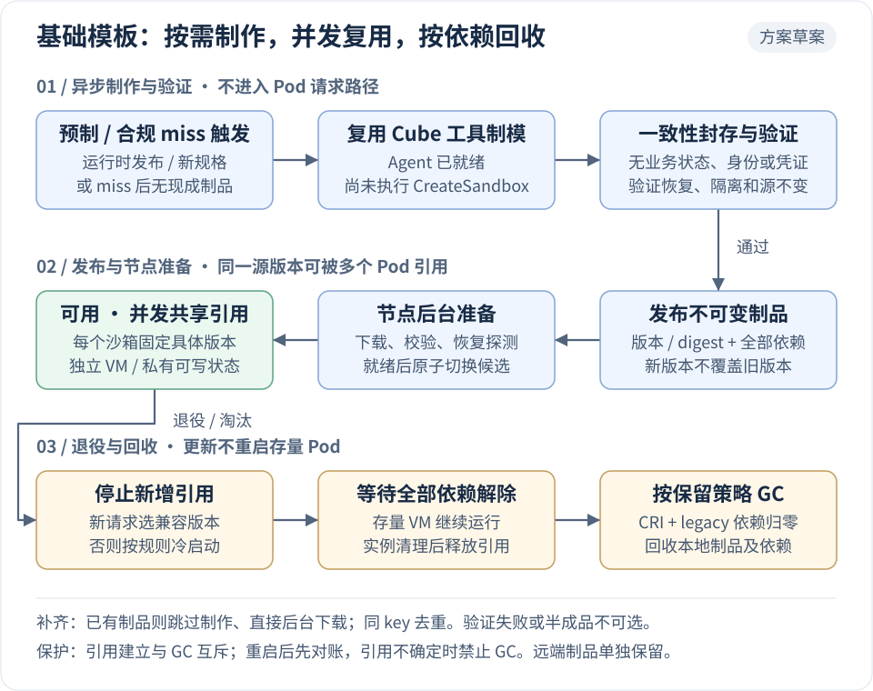
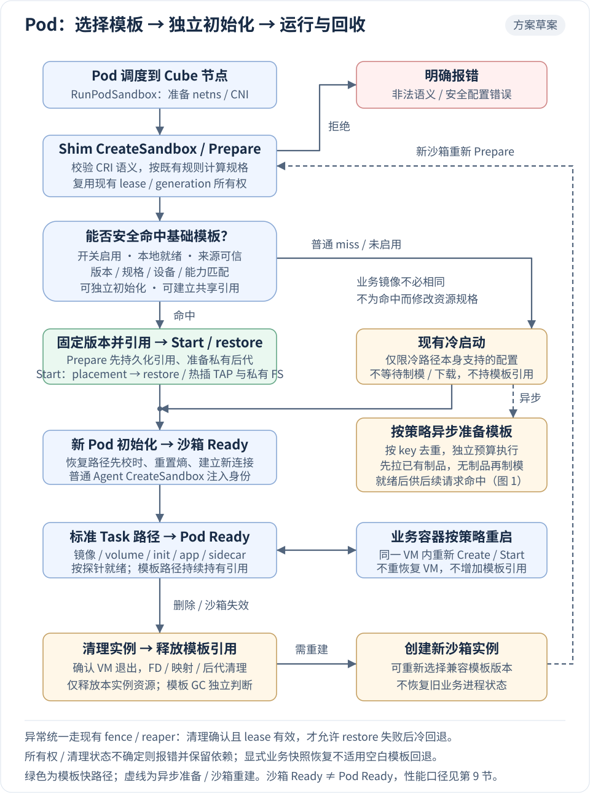

# Cube CRI 复用现有 Template 的一秒启动方案

> 状态：已实现，已完成集群回归与 100 并发模板命中验收
>
> 日期：2026-09-08
>
> 关联：[S5.5 普通冷启动优化](./kubernetes-runtime-performance-s5.5.md)、[S6 开发计划](./kubernetes-runtime-integration-development.md)

## 1. 方案决策

复用 Cube 现有模板制品、目录管理、版本校验、COW 存储和 VMM restore；CRI 增加节点资产适配、新 TAP FD 传递和新 Pod 初始化。

采用「常用规格预制 + 未命中异步补齐」：普通 miss 本次冷启动，同时提交去重后的后台准备需求；优先复用已发布制品，没有匹配制品才调用现有 Cube 能力制作基础模板，就绪后供后续请求派生。

首版使用同一个不可变基础模板并发恢复多个独立 VM，不新增 VM warm pool、独占 Template lease 或模板领取状态机。模板允许并发引用，每个 Pod 的后代资源仍由现有 RuntimeResource lease 管理；仅在实测 restore 无法达标时评估预恢复池。

复用现有制品格式和恢复能力，不代表任意业务模板都可直接用于普通 Pod。首版模板的制作切点为 Agent 已就绪、尚未执行 `CreateSandbox`；已有带业务进程、身份或挂载的模板需另行定义 Task 接管语义。

## 2. 目标与证据边界

本次主目标是 **100 个 Pod 并发提交时，Cube `CreatePodSandbox` P95 < 1s**；保留既有 S6 的 `RunPodSandbox` P95≤700ms、`PodScheduled→Ready` P95≤1s 作为完整链路门禁，三种口径独立报告。

2026-09-08 对 TS4 节点 `10.0.244.241` 查询时，前 3 小时约 322 个成功样本的监控结果如下；该窗口包含多轮测试，不是单轮 100 并发的精确分布。

| 阶段 | 监控估算 P95 |
|---|---:|
| Cube `CreatePodSandbox` | 4.18s |
| `VmmReady` / `VsockReady` | 3.66s / 3.25s |
| `GuestKernelBoot` | 3.17s |
| VMM launch / boot | 42ms / 50ms |
| RuntimeResource Prepare / Agent CreateSandbox | 100ms / 91ms |

直方图的 2.5s→5s 桶较粗，各阶段分位数不能相加；当前证据定位到 Guest 引导等待，还不能证明内核内部具体慢点或冷启动的理论下限。优先复用 template，是因为它已有跳过 Guest 引导的实现。

Cube `CreatePodSandbox` 从 `SandBox::create_sandbox` 开始计时，不包含此前的 CNI 和 RuntimeResource Prepare。已有 100 并发报告的 `scheduled_to_running_observed_ms` P95 约 9.56s，外围剩余耗时需逐 Pod trace 归因，不能全部认定为 kubelet/containerd 排队。

## 3. 现有能力与复用方式

以下为源码已存在的能力，CRI 的兼容性和性能仍需集群验证。

| 能力 | 现有实现 | CRI 接入方式 |
|---|---|---|
| 模板生产与存储制品 | `Cubelet/services/cubebox/appsnapshot.go`、`Cubelet/storage/` | 复用制作、封存和发布能力，补充 Agent-ready 基础模板切点 |
| 模板解析与资产发现 | `Cubelet/pkg/controller/runtemplate/`、`storage/snapshot_catalog.go` | 复用组件与快照解析规则，通过轻量 adapter 返回本地恢复资产 |
| 快照元数据与兼容检查 | `CubeShim/shim/src/hypervisor/snapshot.rs` 的 `SnapshotInfo` | 沿用现有格式、VM 规格和版本校验，按需增加可选 profile/能力字段 |
| 内存 COW 快速恢复 | `hypervisor/vmm/src/memory_manager.rs` | 沿用 fast restore 的快照文件 `MAP_PRIVATE` 映射及现有 cubecow 后端 |
| 网络、文件系统与 vsock 替换 | `CubeShim/shim/src/sandbox/sb.rs` 的 `restore_vm` | 复用 `RestoreConfig.net/fs/vsock/pmem/disks`，补齐 CRI FD 传递 |
| 时间与随机数重置 | 同文件的 `reset_guest` | 恢复后继续校时和重新播种，再执行 Pod 初始化 |
| 实例隔离与回收 | RuntimeResource lease、worker placement、reaper | 将模板引用和后代资产纳入现有所有权与清理记录 |

现有 fast restore 有适用条件，不符合条件时会进入拷贝恢复；首轮验证须确认实际分支。满足条件时无需为每个 Pod 全量复制内存，也不应机械地预建 100 份模板；需要可写持久后代时才调用现有 COW 派生能力。

`cubelet-cri` 当前是独立 RuntimeResource 服务，未初始化完整 legacy 模板栈。优先通过窄接口注入资产解析、存储和后台制模执行器；必要时仅抽取已有实现中的通用部分，保留 `services/runtime` 不依赖 legacy Cubebox/containerd 服务的契约。模板生产与分发在请求外完成，不能将 `AppSnapshot` 同步接入 CRI 请求。

当前实现的节点契约为：`--template-root` 下仅识别 `<TemplateKey>/ready.json`；文件必须原子发布，并包含 `snapshot_base`、可选 `snapshot_memory_vol_url` 和相同的 `template_key`，且 `<snapshot_base>/<cpu>C<memory>M/metadata.json` 与 `snapshot/` 已存在。miss 会以单飞方式执行 `--template-builder`，并追加 `--template-key`、`--output`、`--cpu`、`--memory-mib`。默认 producer 是随 CRI 包安装的 `cube-template-builder`：复用 CubeShim 的 `Snapshot`，以当前 kernel/guest/agent 启动专用无业务 VM，等待 Agent 就绪后封存并原子发布 manifest；不截取触发请求的业务 Pod。自定义 producer 同样必须遵守该发布契约。

## 4. 模板生命周期：何时制作、发布和回收

以下为拟接入 CRI 的生命周期；状态名称用于说明流程，不要求新增 CRD、独立模板控制器或第二套模板状态库。

[](./assets/template-lifecycle-s6.2.svg)

图 1：模板生命周期；按箭头蛇形阅读，点击可查看原始 SVG。

### 4.1 制作时机与模板粒度

**常用规格在运行时发布阶段预制；未覆盖规格由首次合规 miss 触发后台制作。Pod 创建只投递需求，不等待制模或下载。** 自动制模须显式启用，并限定受信的 profile、资源范围和制模预算。

模板按「运行时兼容 profile × VM 规格」复用，不按业务镜像或 Pod 制作。profile 表达架构/CPU 能力、PVM/VMM 恢复兼容性、Guest kernel/基础系统/Agent 版本、设备拓扑和内存恢复模式；具体兼容关系以校验规则和验证结果为准，不能只比较模板名称。

| 触发事件 | 处理方式 |
|---|---|
| 首次启用 CRI template | 发布流程使用现有 Cube 模板工具，为首批支持的 profile/规格制作基础模板 |
| Guest kernel、基础系统、Agent 或恢复协议等兼容项变化 | 生成新制品并重新验证，不覆盖旧制品 |
| 新增受支持的 vCPU/Guest 内存或设备拓扑规格 | 按需增加对应模板；首版不预建所有资源组合 |
| 新节点加入、缓存丢失或节点切换运行时版本 | 优先后台拉取匹配的已发布制品；确无制品且允许自动制模时才制作，未就绪时冷启动 |
| 业务镜像、命令、配置、Pod UID 或副本数变化 | 不重制基础模板；业务内容在恢复后经 Task 路径加载 |
| 请求所需规格尚无已发布模板 | 本次冷启动；同 key 合并为一个后台制模任务，验证完成后加入候选 |

### 4.2 未命中自动补齐

后台准备以 `TemplateKey` 去重：受信制模配方版本、运行时兼容 profile，以及按既有规则推导的 VM 规格/设备拓扑；不包含 Pod UID、业务镜像、命令、Secret 或业务 volume 内容。

| 步骤 | 本次 Pod | 后台任务 |
|---|---|---|
| 本地未命中 | 固定走冷启动，非阻塞投递 key；不查远端、不执行重活 | 同 key 合并需求，创建或复用准备任务 |
| 检查现有制品 | 正常创建业务沙箱，不等待结果 | 已有兼容制品就下载；没有才进入制模 |
| 制作基础模板 | 业务 Pod 独立运行 | 用受信配方启动专用构建 VM，在 Agent-ready、Guest `CreateSandbox` 前封存；不截取业务 Pod |
| 验证与发布 | 不切换已创建或正在创建的沙箱 | 验证完整性及独立恢复，原子加入本地候选，再按既有分发能力发布供其他节点复用 |
| 后续同 key 请求 | 模板 Ready 才命中；尚未 Ready 仍冷启动 | 已有进行中任务不重复启动 |

「同规格」还必须同兼容 profile；只有下一次 Prepare 发生在模板 Ready 之后，才可直接派生。不同节点只有各自准备完成后才能命中，不承诺首个 miss 后紧接着的请求立即加速。

首版约束：

- **执行边界**：节点资产 adapter 管理有界后台任务，调用现有 Cube 制模/存储能力，补充空白切点；不增加独立模板服务、CRD 或 VM 常驻池。现有 `EnsureCubeRunTemplate` 是资产解析入口，不等于从规格自动制模。
- **去重与恢复**：首版节点内按 key 单任务，复用已有本地元数据持久化已接收任务；记录配方版本、任务 generation、阶段和重试时间，重启先对账再继续。发布前校验任务所有权及当前允许版本，过期任务不得发布。
- **资源预算**：首版每节点最多 1 个制模任务，构建/验证 VM 使用独立 cgroup 和 CPU、内存、磁盘预算；前台创建压力或节点资源不足时延后启动，不能把后台消耗记到触发 Pod。
- **限流与失败**：限制队列长度、允许规格数量及模板缓存容量；队列满或投递失败只记录指标，后续 miss 可重试。制模失败按 key 退避并清理临时资产；容量淘汰设置重制冷却期，配方/能力错误等待配置修复，避免重复制模。
- **取消与退役**：任务不绑定单个 Pod 的 RPC context 或 lease，触发 Pod 删除不取消共享任务。关闭自动制模或撤销 profile 时停止接收、收敛在途任务；显式退役/隔离的版本不能因 miss 自动重新启用。

所有自动生成制品必须来自已通过回归的受信配方，用户请求只能在允许范围内选择规格，不能提供制模命令或任意源快照。节点内 100 个同 key miss 最多触发 1 个进行中的任务；跨节点优先复用已发布制品，首版不承诺跨节点全局单次制作。

### 4.3 从制作到节点可用

| 阶段 | 执行方 | 动作与完成条件 |
|---|---|---|
| 制作 | 发布流程或受控后台任务调用现有 Cube 工具 | 在匹配 profile 的隔离构建环境启动空白 VM，等待 Agent 可连接，但不调用 Guest `CreateSandbox`、不创建业务 Task |
| 封存 | 现有 Cube snapshot/storage 链路 | 确认无在途初始化 RPC，按现有一致性快照流程封存；不包含 Pod 网卡、身份、凭证、业务数据或活动业务连接 |
| 验证 | 制品测试流程/后台验证器 | 配方版本先通过并发与异常回归；每份新制品检查完整性，并至少恢复两个身份不同的沙箱，验证初始化、隔离及源制品不变 |
| 发布 | 现有模板发布与目录体系 | 以不可变版本/digest 发布全部依赖，记录基础模板切点和 CRI 初始化能力；只将验证通过的制品加入候选配置 |
| 节点准备 | 节点资产 adapter 复用现有存储能力 | 在后台下载、校验、准备所需本地后端并做恢复探测；完整就绪后原子切换为可选版本，半成品不可见 |
| 使用 | CRI Prepare/Start | 固定具体版本并建立共享引用，为每个沙箱恢复独立 VM 和私有可写状态；同一模板可同时服务 100 个 Pod |

现有 `appsnapshot.go` 面向应用创建/快照，不能据此认定已支持上述空白切点；S6.2a 必须验证并按需补充工具入口，模板格式与存储链路继续复用。模板中的构建期连接不得作为恢复后的可用连接复用。

首版由节点配置维护允许的 handler/profile、制模配方及可选模板映射，普通 Pod 默认无需注解。后台完成后以具体 digest 加入候选；候选切换只影响后续 Prepare，进行中的请求不能随别名漂移。

### 4.4 更新、退役与 GC

区分三类对象：发布制品负责版本交付，节点副本负责本地恢复，沙箱引用负责运行期保活；删除 Pod 不等于删除模板。

| 事件 | 新 Pod | 已恢复的 Pod / 回收约束 |
|---|---|---|
| 发布并验证新版本 | 节点新版本就绪后切换选择；未就绪可用旧的兼容版本，否则冷启动 | 继续使用原版本，不重启、不改挂载 |
| 旧版本退役或容量淘汰 | 停止新增引用 | 活动引用归零且满足保留策略后，才允许删除本地制品及其依赖 |
| 模板校验失败 | 从候选集隔离，按第 5 节规则回退或报错 | 不自动重启存量 Pod；若源资产受损，单独告警并评估影响，不能假定 COW 已脱离源文件 |
| Cubelet/节点重启 | 先核对资产及持久化所有权记录，再恢复模板选择 | 依据既有 lease、worker 和 reaper 状态对账；引用不确定时禁止 GC，不用内存计数推断无人使用 |
| Pod 被删除或沙箱失败 | 不改变其他请求的模板选择 | 确认该实例 VM 退出、映射/FD 关闭及后代依赖清理后，才释放其引用 |

引用必须在资产使用前与 GC 互斥地持久化，绑定现有 sandbox ID、generation 和 lease；这是共享依赖引用，不是模板独占租约。`CreatePodSandbox` 返回或 Pod Ready 后仍保留引用，避免惰性缺页及 COW 后端访问已回收资产。

保护须覆盖既有目录删除、存储 GC、`CleanupTemplateLocalData` 和人工受控清理入口，并计算 legacy Cube 消费者与 CRI 的全部依赖。远端制品删除还需确认各节点及后代依赖均已解除；首版默认保留，由现有发布保留策略处理，不随单个 Pod 回收。

## 5. Pod 复用条件与选择规则

**命中条件：请求属于已支持的普通 CRI 沙箱语义，节点存在兼容且完整的基础模板，新 Pod 的身份与资源能独立初始化。** 以下为首版准入要求，不代表现有 CRI 已实现。

| 检查项 | 可复用条件 | 不满足时 |
|---|---|---|
| 运行时与功能开关 | Pod 经 RuntimeClass/handler 选择 Cube，节点开启基础模板快路径 | Cube 请求继续现有冷启动；其他 handler 不受影响 |
| Pod 显式启动模式 | 未设置或 `agc.cloud.tencent.com/cube-template-mode: auto` | `cold` 强制冷启动，跳过模板查询和异步制模；仅允许 `auto`、`cold`，其他值创建失败 |
| 模板类型与来源 | 受信发布流程（含受控自动制模）产出的 Agent-ready 基础模板，具有新沙箱初始化能力，无业务状态 | 不把任意应用快照当作基础模板；非法来源/配置明确报错 |
| 恢复兼容性 | 架构/CPU 能力、PVM/VMM、快照格式、kernel/基础系统/Agent 符合 profile 与现有校验规则 | 不兼容则冷启动；历史模板缺少能力证明时不命中 |
| VM 规格 | 与现有 `runtime_prepare_plan` 推导出的 vCPU、Guest 内存及恢复所需拓扑匹配 | 无匹配规格则冷启动，允许的 key 异步补齐；不为命中私自扩大 VM 或改变资源约束 |
| 节点资产与引用 | 本地资产完整可用，引用能可靠建立，版本未退役 | 缺失/普通校验失败则隔离并冷启动、后台准备；所有权或清理状态不确定则报错 |
| 网络及实例设备 | 新 netns/TAP FD、MAC/IP、vsock、share 等可按已验证协议替换 | 冷启动支持该配置才回退，否则沿用原有拒绝语义 |
| 内存恢复模式 | 进入已验证的 fast restore 分支；首版不将共享内存/virtio-mem 等拷贝恢复分支纳入快路径 | 暂走冷启动；后续经独立性能验证再扩充 |
| Pod 特殊语义 | 属于已通过冷启动与 restore 双路径回归的功能集合 | 特殊设备直通、未验证拓扑等仅在冷启动本身支持时回退，不能借 template 扩大支持范围 |

现有 `SnapshotInfo` 对部分历史字段保留兼容，例如缺失 Agent 版本并不必然拒绝恢复；CRI 基础模板必须额外证明所需初始化能力，不能仅以旧模板校验通过作为准入依据。当前 CRI 也明确不支持 hostNetwork，模板方案不改变这一限制。

**无需相同的字段**：Pod 名称、UID、namespace、IP、hostname、DNS、业务镜像、命令、环境变量，以及已支持的 init/app/sidecar、Secret/PVC/volume 内容；它们不进入基础模板，而是在新沙箱或 Task 初始化时注入。多容器和 volume 等能力必须先通过恢复路径回归，不能只凭空白模板推断可用。

模板选择只使用 `RunPodSandbox`/Prepare 已可见的信息，不假定能提前拿到全部后续容器配置；快路径需覆盖当前 handler 承诺支持的 Task 操作。后续 Task 不支持的配置仍明确失败，不在容器启动后悄悄重建沙箱切换冷启动。

选择顺序固定为：先校验原有 CRI 语义，再按既有规则计算 VM 规格；`cube-template-mode: cold` 直接冷启动，否则查找并引用兼容模板。普通 miss 冷启动并在策略允许时异步补齐；未启用、未支持、显式冷启动或非法配置不触发制模；显式恢复业务快照不能失败后静默换成空白模板或冷启动。

模板故障隔离可在 Pod metadata 设置：

```yaml
annotations:
  agc.cloud.tencent.com/cube-template-mode: cold
```

该设置只作用于本次沙箱及其重建，不修改节点模板状态；移除或设为 `auto` 后，后续新沙箱恢复默认选择。

例如，nginx Pod 首次请求某个允许的 key 时没有模板，则冷启动并触发后台制作；模板就绪后，同 key 的 busybox Pod 可直接派生。Guest 内存不同则是另一个 key，需分别准备；100 个同 key 副本只需一个源模板和 100 份实例私有状态。

## 6. Pod 生命周期与模板的关系

下表区分 Kubernetes Pod、CRI 沙箱和业务容器；沙箱 Ready 不等于 Pod Ready。当前 Shim 的 `CreateSandbox` 负责 Prepare，`StartSandbox` 才进入 `SandBox::create_sandbox`，不要与 Guest Agent 同名 RPC 混淆。

[](./assets/pod-template-flow-s6.2.svg)

图 2：普通 CRI Pod 的创建与回收；绿色为模板快路径，普通 miss 按策略触发异步准备，异常处理见图底部。

| 阶段 / 事件 | Pod / 沙箱动作 | 模板动作与所有权 |
|---|---|---|
| 调度前 | 用户正常提交 Pod，调度器选节点 | 不为每个 Pod 制模；未另行建设调度感知时，不保证选中模板已就绪节点 |
| `RunPodSandbox` 前置阶段 | containerd 按既有流程准备 netns/CNI 与沙箱配置 | 模板不接管 CNI/IPAM，不能继承构建环境网络 |
| Shim `CreateSandbox` / Prepare | 校验语义、计算规格，建立现有 lease 和资源记录 | 命中先固定版本、记录引用再准备后代；miss 固定冷启动，按策略投递独立后台准备任务 |
| Shim `StartSandbox` | 获取本实例 TAP，完成 Host placement 后启动 worker/VMM | 使用源模板 restore；恢复后热插入本 Pod 独有 virtio-net/TAP，再绑定 vsock，不修改源模板 |
| Guest 初始化 / 沙箱 Ready | 校时、重置熵，执行普通 Agent `CreateSandbox`，设置独立身份、网络和共享 namespace | 不走跳过初始化的应用 RESTORE 分支；成功后仍持有源模板引用 |
| init/app/sidecar 创建启动 | 经标准镜像、Task、volume 和探针流程，达到条件后 Pod Ready | 不再次恢复模板；模板加速不等于省略镜像拉取、init 容器或 readiness 等待 |
| 业务容器退出并按策略重启 | 沙箱仍有效时，在同一 VM 中重新 Create/Start 对应容器 | 不重新选模板，不恢复整个 VM，不重置其他容器 |
| 沙箱丢失、失效或需重建 | 清理旧实例，再由既有 CRI 流程创建新沙箱；同一 Pod UID 可能对应新的 sandbox ID | 新实例重新 Prepare，可选新模板版本；不恢复旧业务进程状态，旧引用独立回收 |
| Pod 资源更新 | 遵循现有更新能力与限制；需重建时走既有重建流程 | 不因候选模板更新而热换模板，也不新增 VM 热扩缩能力 |
| Pod 删除 / `StopPodSandbox` / `RemovePodSandbox` | 按既有顺序停止 Task/VM，释放本实例设备、网络及后代资源 | VM 与后代依赖解除后释放引用；幂等重试，不能删除其他 Pod 使用的源模板 |
| 创建取消、超时或组件崩溃 | 现有 generation/lease fence 和 reaper 收敛失败实例 | 清理确认后释放引用；可证明安全时才 cold fallback，不确定时保留依赖并报错 |

Pod 进入 Succeeded/Failed、探针失败或 API 对象消失，都不能单独证明 VM 已回收；模板释放以运行时资源的实际清理结果为准。跨节点重建由新节点重新选择本地兼容模板，不迁移旧节点模板引用。

## 7. 最小接入改动

### 7.1 基础模板与资源准备

按第 4～6 节接入基础模板切点、节点资产 adapter、准入选择和持久化共享引用；adapter 增加按 key 去重的有界后台准备队列，复用既有制模、元数据和存储能力。实例继续使用 Prepare/Release/reaper；模板不保留 virtio-net 或 Pod 私有 `cubeVolumes`，恢复后分别热插入本 Pod 的新网卡和 virtiofs。

### 7.2 Restore 网络 FD 适配

基础模板不包含任何网络设备或 CNI 状态。恢复后 Shim 以本 Pod 的 CNI TAP FD 热插入 virtio-net，worker 通过 `SCM_RIGHTS` 交接 FD；客体驱动完成新设备协商，旧应用快照网络语义保持不变。

网络替换请求携带本次 CNI 的 MAC、MTU、队列数和跨 netns 标记；FD 保持有效直到 VMM 完成接管，失败时精确回收。模板 key 包含该网络拓扑与 FD 合约格式，格式变更自动失效旧制品。

恢复期间 Guest 不得通过模板旧网络通信；CNI 和 NetworkPolicy 仍由 containerd/CNI 管理。

### 7.3 新 Pod 初始化

当前 Agent `CreateSandbox(start_mode=RESTORE)` 只执行 virtiofs 挂载后返回，跳过网络、hostname、sandbox ID、共享 namespace 和 DNS 初始化；直接使用该模式不能创建身份独立的新 Pod。

将“VM 从快照恢复”与“接管快照中的业务容器”分开表达。首版在空白 Agent 模板恢复后，复用普通 `CreateSandbox` 的初始化逻辑；通过能力协商区分基础模板和现有应用恢复，保持既有 APP snapshot、Pause/Resume 行为。

新 Pod 初始化前完成校时、熵重置和新 vsock 连接；基础模板启动时已固化 `agent.unified_cgroup_hierarchy=true`，保证恢复后的资源事务使用 cgroup v2。Host cgroup placement 在 worker 恢复和分配 Guest 内存前完成。Pod UID 留在 CRI/Host 所有权记录中，Agent 接收其现有协议需要的 sandbox ID、网络、hostname、DNS 和 namespace 参数。

业务镜像、OCI rootfs、init/app/sidecar、Secret、PVC 和 volume 继续经标准 Task 路径动态创建；不继承模板中的业务容器 ID，不跳过业务容器的 Create/Start。测试须确认无旧挂载、连接、随机状态或凭证遗留。

### 7.4 失败与回滚

复用现有 generation/lease/FD fence、worker parent-death 和 reaper。Prepare 重试必须复用或清理同一实例资源；不同 Pod 引用同一模板不得互相串行化。

restore 失败后，只有确认失败 VM、FD 和后代资产已清理且现有 lease 仍有效，才允许同请求 cold fallback；否则交给既有失败恢复。Shim 退出继续执行现有 worker 回收，不新增跨 Shim 接管运行 VM 的能力。模板更新只影响后续请求。

## 8. 实施顺序

| 阶段 | 工作项 | 退出条件 |
|---|---|---|
| S6.2a：制品与恢复链路 | 基础模板切点、后台去重制模/分发；接入资产 adapter、准入检查、引用保护和 worker restore | fast restore、首次 miss→制模→后续 hit、限流/退避、版本切换、GC 竞争及重启对账通过 |
| S6.2b：身份与设备注入 | 注入 TAP FD、vsock/share 替换、普通 Agent 初始化、Task 生命周期 | 50 串行与 10 并发身份独立；网络、volume、取消和重启回归通过 |
| S6.2c：性能与密度 | 固定制品执行 100 并发、持续 churn 和 1/5/20/100 Pod 资源测试 | 本次 <1s 目标和既有 S6 门禁分别出具结果；按峰值及稳态标定 overhead |

各阶段先验证复用路径，再增加有实测依据的改动；模板命中仍未达标时，按 restore、缺页、网络和外围时间线归因，再决定是否需要预恢复池。

## 9. 性能预算与验收

以下为待验证的工程预算，不是既有 template 的性能承诺。

| 区间 | 目标预算 |
|---|---:|
| Cube `CreatePodSandbox` 内：配置、worker launch 和 restore | 350ms |
| Cube `CreatePodSandbox` 内：连接、校时/熵和 Agent 初始化 | 150ms |
| Cube `CreatePodSandbox` 内：其他处理及抖动余量 | 100ms |
| `RunPodSandbox` 中的其他阶段：CNI、Prepare、Shim 创建等 | 需与内部路径共同满足既有 700ms 门禁 |

使用固定节点、制品 digest、VM 规格和预缓存镜像，执行 50 次串行、5×10 并发以及至少 3 轮×100 并发；保持业务资源限制，记录每轮及汇总 P50/P95/P99、最大值、成功率和批次跨度。正式分位数采用逐 Pod 单调时钟样本，监控直方图用于定位。

100 个 API 并发提交不等于 100 个 restore 同时执行，报告必须记录实际 runtime 并发与入口排队。cold、template hit、miss/fallback 和全量请求分别统计，不能只用命中样本声明整体达标；模板已准备和模板缺失场景均需验证。

一秒目标的性能用例须明确模板就绪、规格覆盖和命中率前提。若要求任意新节点、未覆盖规格或模板缺失时也 P95 <1s，则本方案尚不能保证，需要另行解决冷启动或节点接流量门禁；任意业务 Pod 的 Ready 时间也受镜像、init 容器和探针影响。

自动制模改善的是后续命中率，不能让首次 miss 加速。分别测试冷缓存首轮、后台制模期间和模板 Ready 后的 100 并发，记录制模耗时、排队、命中率及对前台 P95 的干扰；不能只报告最后一轮。

### 9.1 2026-09-09 集群验收结果

节点 `10.0.244.241` 使用 v11 基础模板完成一次 cold miss（异步制模）和一次真实 hit 的完整冒烟；两次均通过 init、volume、readiness、日志、exec、共享网络和 RuntimeClass overhead。hit 实例日志确认使用 `1C512M-fbbca56140d3784a`，VMM 顺序执行 `restore → VmAddNet → VmAddFs`。

随后执行 100 Pod、100 并发、预缓存镜像的模板命中测试，100/100 Pod 创建、调度、运行和 Ready 成功。`shim/CreatePodSandbox` 直方图由 2 个历史样本增至 102 个；本轮新增 100 个样本中，6 个 ≤50ms、50 个 ≤100ms、100 个 ≤250ms，因此 **P95 可证明不高于 250ms**，满足 `<1s` 目标。直方图没有更细桶，不能将该上界表述为精确 P95。

同批 e2e 客户端观测的 `create_api_ms` P95 为 1054.982ms，`create_start_to_ready_observed_ms` P95 为 49267.095ms；前者是 Kubernetes API 请求时延，后者包含调度、kubelet 排队和容器启动，均不是 `CreatePodSandbox` 指标，需作为后续端到端优化项独立处理。

补充有限基数的启动模式、fallback 原因、restore 分段和模板引用指标；模板 ID、Pod UID、sandbox ID 与 lease 放入日志。加密 0.5～5s 直方图桶，关联 worker CPU throttling、缺页、PSI、memory peak、稳态 cgroup/PSS；惰性恢复的缺页成本须在 Task 启动及首个实际工作负载中复验。

集群回归覆盖多容器、init/sidecar、网络隔离、DNS/Service、volume、资源限制、安全上下文、并发取消和组件重启，并回归既有 Cube template/应用恢复。测试后实例 VM、TAP、FD、mount、active lease 和 reaper 恢复基线，保留的模板资产及引用数单列。

生命周期专项验收至少覆盖以下场景：

- 制模失败、分发中断和制品损坏不进入候选集；未命中请求不等待制作或下载。
- 100 个同 key miss 在节点内只创建一个后台任务；已有可下载制品不重制，新制品 Ready 后同 key 请求命中。
- 后台任务在触发 Pod 删除、Cubelet 重启后正确收敛；队列满、预算不足、失败退避不阻塞冷启动，不泄漏构建 VM。
- 不同 key 按配额排队；越权配方、超范围规格、禁用/退役版本不自动制作，GC 与重制冷却策略避免反复抖动。
- 不同业务镜像且同规格的 Pod 命中同一模板；规格/能力不匹配正确回退，原本不支持的语义仍拒绝。
- 100 个 Pod 并发引用同一版本无独占串行；并发写入互不污染，源模板内容不变。
- 同沙箱容器重启不增加模板引用；沙箱重建产生独立新引用，旧实例清理后无引用泄漏。
- A→B 发布及 B→A 回滚只影响新请求；A 上的运行 VM 在延迟缺页、Task 重启时仍正常。
- Prepare/GC 竞争、取消、Shim/Cubelet/节点重启后引用正确对账；有 CRI 或 legacy 依赖时任何受控 GC 入口都不能删除源资产。
- 全部引用及后代依赖解除后旧版本可回收；保留的发布版本/节点缓存不误报为 Pod 资源泄漏。

本方案只调整 CRI 接入设计，不改变现有 S5.5/S6 阶段状态；是否达到一秒目标以最终制品的集群验收为准。
